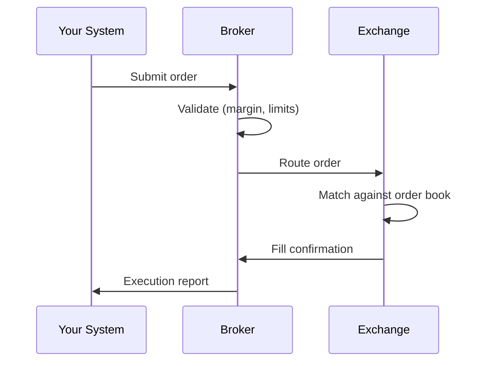

# Trading Mechanics

## Overview

This chapter covers how trades actually execute — the order types available, what happens when you submit an order, and the hidden costs that affect your strategy's profitability.

## Order Types

### Market Order

A **market order** executes immediately at the best available price. You're guaranteed a fill but not a price.

```python
# Pseudocode: Market order
order = {
    "side": "buy",
    "type": "market",
    "symbol": "AAPL",
    "qty": 100
}
# Executes at current best ask price
```

**When to use**: When you need immediate execution and the spread is tight.

**Risk**: In fast-moving or illiquid markets, you may get filled at a worse price than expected (**slippage**).

### Limit Order

A **limit order** specifies the maximum price you'll pay (buy) or minimum price you'll accept (sell). It only executes at your price or better.

```python
# Buy limit: only fill at $150 or below
order = {
    "side": "buy",
    "type": "limit",
    "symbol": "AAPL",
    "qty": 100,
    "limit_price": 150.00
}
```

**When to use**: When price control matters more than execution speed.

**Risk**: The order may never fill if the market doesn't reach your price.

### Stop Order

A **stop order** becomes a market order when the price reaches a specified trigger level. Used primarily for risk management.

```python
# Stop loss: sell if price drops to $145
order = {
    "side": "sell",
    "type": "stop",
    "symbol": "AAPL",
    "qty": 100,
    "stop_price": 145.00
}
```

**When to use**: To limit losses on an existing position.

**Risk**: In a gap down (price jumps past your stop), execution price may be significantly worse than your stop price.

### Stop-Limit Order

A **stop-limit order** combines stop and limit orders. When the stop price is triggered, a limit order is placed instead of a market order.

```python
# Stop-limit: trigger at $145, limit at $144.50
order = {
    "side": "sell",
    "type": "stop_limit",
    "symbol": "AAPL",
    "qty": 100,
    "stop_price": 145.00,
    "limit_price": 144.50
}
```

**When to use**: When you want downside protection but also price control.

**Risk**: If the price gaps below both your stop and limit prices, the order won't fill at all — you're left holding the position.

### Order Type Comparison

| Order Type | Price Control | Execution Guarantee | Best For |
|-----------|--------------|-------------------|----------|
| Market | None | Yes | Immediate execution |
| Limit | Full | No | Price-sensitive entries |
| Stop | None (after trigger) | Yes (after trigger) | Stop losses |
| Stop-Limit | Full (after trigger) | No | Controlled stop losses |

## Execution Mechanics

### What Happens When You Submit an Order



1. **Submission**: Your code sends an order to the broker's API
2. **Validation**: The broker checks account balance, margin, and risk limits
3. **Routing**: The broker routes the order to an exchange or market maker
4. **Matching**: The exchange's matching engine finds a counterparty
5. **Confirmation**: Fill details are sent back through the broker to your system

### Time in Force

Orders can have different lifespans:

| Time in Force | Meaning |
|--------------|---------|
| **DAY** | Expires at market close if unfilled |
| **GTC** | Good Till Cancelled — stays open indefinitely |
| **IOC** | Immediate or Cancel — fill what you can, cancel the rest |
| **FOK** | Fill or Kill — fill entirely or cancel entirely |

## Trading Costs

### Commissions

Most retail brokers now offer **commission-free** trading for US equities and ETFs. However, some still charge:

- **Per-share**: $0.005/share (common for institutional/API brokers)
- **Per-trade**: Flat fee per order (less common now)
- **Crypto**: 0.1%–0.5% maker/taker fees

{: .important }
Even with "free" commissions, you're still paying costs through the spread and potential slippage. These are often larger than commissions for small orders.

### Slippage

**Slippage** is the difference between the expected execution price and the actual execution price.

```python
# Slippage example
expected_price = 150.00  # Price when signal generated
actual_price = 150.03    # Price when order filled
slippage = actual_price - expected_price  # $0.03 per share

# On 1000 shares:
total_slippage = slippage * 1000  # $30
```

Slippage is caused by:
- **Market movement** between signal and execution
- **Order book depth** — large orders consume multiple price levels
- **Latency** — delay between decision and order reaching the exchange

{: .tip }
Always model slippage in your backtests. A strategy that looks profitable with zero slippage may lose money with realistic slippage of $0.01–$0.05 per share.

### Spread Cost

Every round trip (buy then sell) costs you at least the spread:

```python
# Spread cost on a round trip
buy_price = 150.03   # Buy at the ask
sell_price = 150.02   # Sell at the bid
spread_cost = buy_price - sell_price  # $0.01 per share

# For 1000 shares traded 100 times:
total_spread_cost = 0.01 * 1000 * 100  # $1,000
```

### Market Impact

Large orders can **move the market** against you. If you're buying 50,000 shares but only 1,200 are available at the best ask, your order walks up the book:

```
Before your order:          Your 50,000 share buy fills:
Ask $150.03 × 1,200    →   Filled 1,200 @ $150.03
Ask $150.04 × 500      →   Filled 500   @ $150.04
Ask $150.05 × 200      →   Filled 200   @ $150.05
                            ... continues up the book
```

{: .note }
Market impact is primarily a concern for large accounts. For accounts under $100K trading liquid stocks, market impact is negligible.

## Summary

- **Market orders** guarantee execution; **limit orders** guarantee price
- **Stop orders** protect against losses but may slip in fast markets
- Trading costs = commissions + spread + slippage + market impact
- Always model realistic trading costs in backtests
- For liquid instruments (SPY, AAPL), costs are minimal; for illiquid stocks, they can destroy a strategy

## Next Steps

Next, we'll learn the **financial metrics** used to measure trading performance — returns, volatility, Sharpe ratio, and more.
