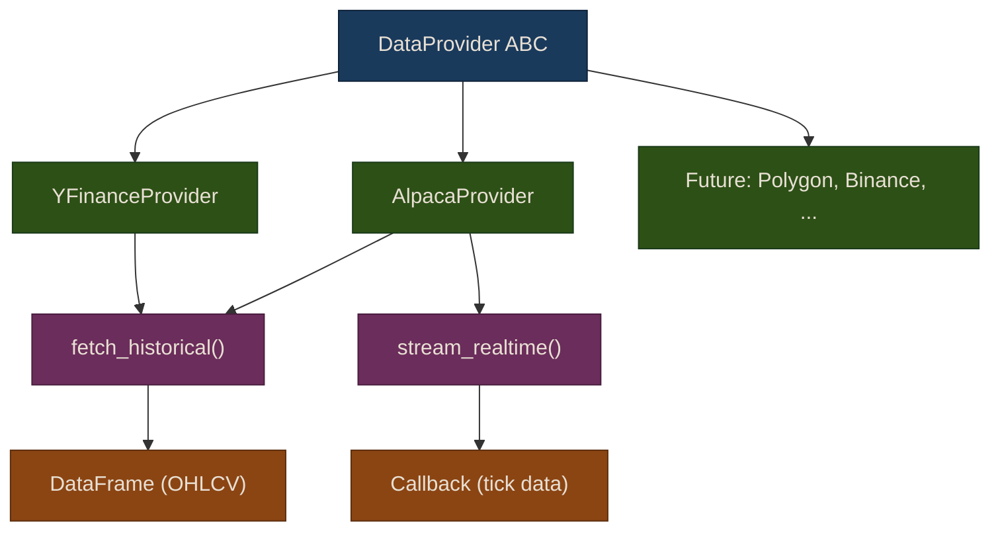

# Data Providers

## Overview

A data provider is any service that delivers market data to your trading system -- historical bars, real-time quotes, or streaming trades. Different providers have different strengths: yfinance is free but limited to delayed daily data, while Alpaca offers real-time streaming suitable for live trading. The key design decision is to abstract the data source behind a common interface so you can swap providers without rewriting your strategies.

## The DataProvider Interface

We define an abstract base class that every data provider must implement. This is the **Strategy pattern** -- it lets us add new data sources (Polygon.io, Binance, Interactive Brokers, etc.) without modifying any consuming code:

```python
from puffin.data.provider import DataProvider
```

The interface looks like this:

```python
from abc import ABC, abstractmethod
from datetime import datetime
import pandas as pd

class DataProvider(ABC):
    """Base class for market data providers."""

    @abstractmethod
    def fetch_historical(
        self,
        symbols: str | list[str],
        start: str | datetime,
        end: str | datetime | None = None,
        interval: str = "1d",
    ) -> pd.DataFrame:
        """Fetch historical OHLCV data.

        Args:
            symbols: Ticker symbol(s) to fetch.
            start: Start date.
            end: End date (defaults to today).
            interval: Bar interval (e.g., '1m', '5m', '1h', '1d').

        Returns:
            DataFrame with columns: Open, High, Low, Close, Volume.
            MultiIndex (Date, Symbol) for multiple symbols.
        """

    @abstractmethod
    def get_supported_assets(self) -> list[str]:
        """Return list of supported asset types."""

    def stream_realtime(self, symbols: list[str], callback):
        """Stream real-time market data. Optional."""
        raise NotImplementedError
```

{: .note }
This pattern is called the **Strategy pattern** (not to be confused with trading strategies). It lets us add new data sources (Polygon.io, Binance, etc.) without modifying existing code.

Every provider guarantees that `fetch_historical` returns a pandas DataFrame with OHLCV columns (`Open`, `High`, `Low`, `Close`, `Volume`). When you request multiple symbols, the result uses a MultiIndex of `(Date, Symbol)` so you can easily slice by ticker.

The `stream_realtime` method is optional -- providers that do not support streaming will raise `NotImplementedError`. This keeps the interface honest: you can check at runtime whether a provider supports real-time data rather than discovering the limitation in production.

## Provider Architecture



## Fetching Data with yfinance

The simplest provider uses yfinance -- free, no API key required, and covers equities, ETFs, indices, and crypto:

```python
from puffin.data import YFinanceProvider

provider = YFinanceProvider()

# Single ticker
aapl = provider.fetch_historical("AAPL", start="2023-01-01", end="2024-01-01")
print(aapl.head())
```

The returned DataFrame looks like this:

```
                  Open        High         Low       Close     Volume
Date
2023-01-03  130.279999  130.899994  124.169998  125.070000  112117500
2023-01-04  126.889999  128.660004  125.080002  126.360001   89113600
2023-01-05  127.129997  127.769997  124.760002  125.019997   80962700
...
```

You can also fetch multiple tickers in a single call:

```python
# Multiple tickers
data = provider.fetch_historical(
    ["AAPL", "MSFT", "GOOGL"],
    start="2023-01-01",
    end="2024-01-01"
)
```

{: .tip }
yfinance is rate-limited and occasionally returns incomplete data. Always validate what you receive before using it in a backtest. The caching layer (covered in the next chapter) eliminates redundant API calls and protects you from rate limits.

### Interval Options

The `interval` parameter controls bar granularity:

| Interval | Description | Max History |
|----------|-------------|-------------|
| `1m` | 1-minute bars | ~7 days |
| `5m` | 5-minute bars | ~60 days |
| `1h` | Hourly bars | ~730 days |
| `1d` | Daily bars | Full history |
| `1wk` | Weekly bars | Full history |

{: .warning }
Intraday data from yfinance has limited history. If you need months of minute-level data, you will need a paid provider like Polygon.io or Alpaca's historical API.

## Real-Time Data with Alpaca

For paper and live trading, you need real-time data. The `AlpacaProvider` connects to Alpaca's WebSocket API and delivers streaming bars, quotes, and trades:

```python
from puffin.data.alpaca_provider import AlpacaProvider

provider = AlpacaProvider()  # Reads API keys from .env

# Stream real-time bars
def on_update(symbol, price, volume, timestamp):
    print(f"{symbol}: ${price:.2f} ({volume} shares) at {timestamp}")

provider.stream_realtime(["AAPL", "MSFT"], callback=on_update)
```

The `AlpacaProvider` also implements `fetch_historical`, so you can use the same interface for both historical backtesting and live trading:

```python
# Historical data via Alpaca (useful for verifying data quality against yfinance)
alpaca_data = provider.fetch_historical("AAPL", start="2023-01-01", end="2024-01-01")
```

{: .important }
Alpaca requires API keys. Create a free paper trading account at [alpaca.markets](https://alpaca.markets/) and store your keys in a `.env` file. Never commit API keys to version control.

### Comparing Providers

| Feature | YFinanceProvider | AlpacaProvider |
|---------|-----------------|----------------|
| Cost | Free | Free (paper), paid (live) |
| API key required | No | Yes |
| Historical data | Full history (daily) | 5+ years |
| Real-time streaming | No | Yes (WebSocket) |
| Asset coverage | Global equities, ETFs, crypto | US equities, crypto |
| Rate limits | Yes (undocumented) | 200 req/min |
| Best for | Research, backtesting | Paper trading, live trading |

## Adding a Custom Provider

To add a new data source, simply subclass `DataProvider`:

```python
from puffin.data.provider import DataProvider

class PolygonProvider(DataProvider):
    def fetch_historical(self, symbols, start, end, interval="1d"):
        # Your Polygon.io API logic here
        ...

    def get_supported_assets(self):
        return ["equity", "option", "crypto", "forex"]

    def stream_realtime(self, symbols, callback):
        # WebSocket streaming logic
        ...
```

No other code in the system needs to change. Your strategies, backtester, and risk manager all work through the `DataProvider` interface.

## Exercises

1. Fetch 5 years of daily SPY data using `YFinanceProvider` and examine the data quality -- how many missing days are there? Are there any outlier returns?
2. Write a `CSVProvider` that reads OHLCV data from local CSV files. Implement `fetch_historical` and `get_supported_assets`.
3. Fetch the same ticker and date range from both `YFinanceProvider` and `AlpacaProvider` (if you have an API key). Compare the close prices -- are they identical? What accounts for the differences?

## Summary

- The `DataProvider` abstract interface decouples your trading system from any specific data source
- `YFinanceProvider` gives free historical data with no setup -- ideal for research and backtesting
- `AlpacaProvider` adds real-time streaming for paper and live trading
- New providers can be added by subclassing `DataProvider` without changing existing code

## Next Steps

With data flowing into your system, the next question is: where do you store it? In the next chapter, you will build a caching and storage layer that eliminates redundant API calls and persists data efficiently.
