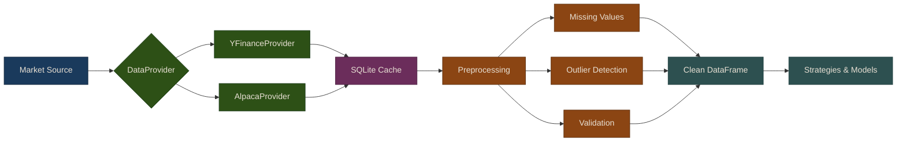

# Part 2: Data Pipeline

Every trading system starts with data. Before you can build strategies, train models, or execute trades, you need a reliable pipeline that fetches market data, stores it efficiently, and cleans it for downstream consumption. A poorly built data pipeline leads to stale prices, missing bars, and ultimately wrong trading decisions.

This section walks you through building a production-quality data pipeline from scratch. You will implement a pluggable provider interface that abstracts away the data source, a caching layer that eliminates redundant API calls, and a preprocessing module that handles the messy realities of real-world market data.

## Data Pipeline Architecture

## Chapters

1. [Data Providers](01-data-providers) -- The DataProvider interface, yfinance for free historical data, and Alpaca for real-time streaming
2. [Caching & Storage](02-caching-storage) -- SQLite cache for fast lookups, HDF5 and Parquet for long-term storage with MarketDataStore
3. [Preprocessing](03-preprocessing) -- Handling missing values, outlier detection, data validation, and the preprocessing pipeline

{: .tip }
> **Notebook**: Run the examples interactively in [`data_pipeline.ipynb`](https://github.com/MichaelTien8901/puffin/blob/main/notebooks/data_pipeline.ipynb)

## Related Chapters

- [Part 3: Alternative Data]({{ site.baseurl }}/03-alternative-data/) -- Alternative data feeds into the pipeline as a non-traditional data source
- [Part 4: Alpha Factors]({{ site.baseurl }}/04-alpha-factors/) -- Alpha factors consume clean data produced by the pipeline
- [Part 7: Backtesting]({{ site.baseurl }}/07-backtesting/) -- The backtesting engine relies on historical data delivered by the pipeline

## Source Code

Browse the implementation: [`puffin/data/`](https://github.com/MichaelTien8901/puffin/tree/main/puffin/data)
