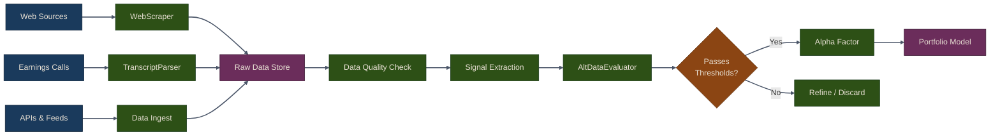

# Part 3: Alternative Data

Traditional financial data (prices, volumes, fundamentals) is widely available and heavily analyzed. Alternative data provides an edge by revealing information before it appears in conventional sources. In this section, you will learn to source, parse, and evaluate alternative data for trading signals.

## What is Alternative Data?

Alternative data refers to non-traditional information sources that can provide trading signals:

- **Web data**: Earnings transcripts, news sentiment, social media
- **Satellite imagery**: Retail parking lots, shipping traffic, agricultural output
- **Transaction data**: Credit card purchases, app downloads, web traffic
- **Sensor data**: Weather patterns, foot traffic, supply chain monitoring

{: .note }
The key advantage of alternative data is **information asymmetry**. You gain insights before the market broadly recognizes them.

## Types of Alternative Data

### 1. Textual Data
- Earnings call transcripts
- SEC filings (10-K, 10-Q, 8-K)
- News articles and press releases
- Social media sentiment

### 2. Behavioral Data
- Web traffic and search trends
- App downloads and usage
- Credit card transactions
- Geolocation data

### 3. Sensor and Satellite Data
- Satellite imagery (parking lots, ships, crops)
- Weather data
- IoT sensor readings

### 4. Market Microstructure
- Order book depth
- Trade-level data
- Dark pool activity

{: .warning }
Always verify data licensing and ensure compliance with regulations. Some alternative data sources have strict usage terms.

## Alternative Data Pipeline

The diagram below shows how raw alternative data flows through collection, parsing, evaluation, and finally into a tradable signal.

## Chapters

1. [Web Scraping & Transcript Parsing](01-web-scraping-transcripts) -- Sourcing public data with WebScraper and extracting structure from earnings calls with TranscriptParser
2. [Alternative Data Evaluation](02-alt-data-evaluation) -- Measuring signal quality, data quality, and backtesting alternative data signals with AltDataEvaluator

## Best Practices

1. **Start Simple**: Web scraping and sentiment analysis are accessible starting points
2. **Validate Rigorously**: Use IC, IR, and backtests before deploying
3. **Monitor Decay**: Alternative data edges erode as they become known
4. **Respect Terms**: Always check website terms of service and robots.txt
5. **Version Data**: Track data provenance and changes over time

## Summary

- Alternative data provides information asymmetry and early signals
- Web scraping with `WebScraper` accesses public financial data
- `TranscriptParser` extracts structure and sentiment from earnings calls
- `AltDataEvaluator` rigorously tests signal and data quality
- IC, IR, and decay metrics distinguish useful signals from noise
- Always validate alternative data before deploying capital

{: .tip }
> **Notebook**: Run the examples interactively in [`data_pipeline.ipynb`](https://github.com/MichaelTien8901/puffin/blob/main/notebooks/data_pipeline.ipynb)

## Related Chapters

- [Part 2: Data Pipeline]({{ site.baseurl }}/02-data-pipeline/) -- The data pipeline provides the foundation for ingesting and storing alternative data
- [Part 4: Alpha Factors]({{ site.baseurl }}/04-alpha-factors/) -- Alternative data signals are transformed into tradable alpha factors
- [Part 13: NLP for Trading]({{ site.baseurl }}/13-nlp-trading/) -- NLP techniques process the textual alternative data collected here
- [Part 14: Topic Modeling]({{ site.baseurl }}/14-topic-modeling/) -- Topic models discover latent themes in earnings transcripts and news

## Source Code

Browse the implementation: [`puffin/data/`](https://github.com/MichaelTien8901/puffin/tree/main/puffin/data)

## Next Steps

In Part 4, we'll use alternative data to construct **alpha factors** and combine them into multi-factor models.
