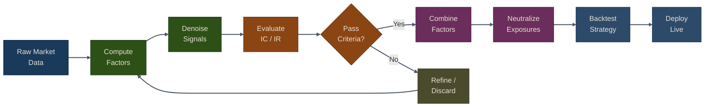

# Alpha Factor Research

Alpha factors are the building blocks of quantitative trading strategies. They are signals that predict future asset returns and form the basis of systematic investment decisions. In this chapter, we'll explore how to compute, evaluate, and combine various types of alpha factors using the Puffin framework.

## What Are Alpha Factors?

An alpha factor is a quantitative signal that captures some aspect of market behavior or asset characteristics that may predict future returns. The term "alpha" refers to excess returns above a benchmark.

{: .tip }
> **Plain English:** Alpha is your "skill" versus "luck." If the tide lifts all boats (the market goes up), Alpha is having a motor that makes you go *even faster*. Specifically: if the market returns 10% and you return 15%, your Alpha is that extra 5%.

Key characteristics of good alpha factors:
- **Predictive Power**: Strong correlation with future returns
- **Stability**: Consistent performance across different time periods
- **Low Correlation**: Independent from other factors in your portfolio
- **Implementability**: Can be traded with reasonable transaction costs

## Alpha Factor Research Pipeline

The following diagram illustrates the end-to-end workflow for discovering, refining, and deploying alpha factors:

## Types of Alpha Factors

Alpha factors can be broadly categorized into the following types:

| Category | Examples | Data Source |
|:---------|:---------|:------------|
| **Momentum** | Price momentum, acceleration, trend strength | Price/volume |
| **Value** | P/E, P/B, EV/EBITDA, earnings yield | Fundamentals |
| **Volatility** | Realized vol, Parkinson, Garman-Klass | OHLC prices |
| **Quality** | ROE, ROA, profit margin, accruals | Financials |
| **Technical** | RSI, MACD, Bollinger Bands, ADX | Price/volume |
| **Signal Processing** | Kalman-filtered trend, wavelet-denoised signals | Derived |
| **Formulaic** | WorldQuant-style rank/delta/ts_mean expressions | Price/volume |

{: .note }
> Each factor category is covered in detail in the sub-pages below. Start with momentum, value, and volatility factors, then move on to signal processing with Kalman filters and wavelets, and finally learn how to evaluate and combine factors for deployment.

## Chapter Contents

1. **[Momentum, Value & Volatility Factors](01-momentum-value-volatility.md)** -- Compute the classic factor families (momentum, value, volatility, quality) and explore technical indicators with TA-Lib.
2. **[Kalman Filters & Wavelets](02-kalman-wavelets.md)** -- Denoise financial signals using Kalman filters and wavelet decomposition for cleaner alpha signals.
3. **[Factor Evaluation](03-factor-evaluation.md)** -- Evaluate factor quality with Alphalens-style tearsheets, build WorldQuant formulaic alphas, and combine multiple factors into a composite signal.

## Next Steps

Now that you understand alpha factor research, you can:
- Learn about machine learning-based factors in Part 5
- Backtest your factors in Part 7
- Implement risk management in Part 8
- Deploy factors in live trading in Part 9

## Further Reading

- Kakushadze, Z. (2016). ["101 Formulaic Alphas"](https://arxiv.org/abs/1601.00991). Wilmott Magazine.
- Stambaugh, R. F., & Yuan, Y. (2017). "Mispricing Factors". Review of Financial Studies.
- Hou, K., Xue, C., & Zhang, L. (2015). ["Digesting Anomalies"](https://doi.org/10.1093/rfs/hhu068). Review of Financial Studies.
- Prado, M. L. (2018). ["Advances in Financial Machine Learning"](https://www.wiley.com/en-us/Advances+in+Financial+Machine+Learning-p-9781119482086). Wiley.

## Related Chapters

- [Part 2: Data Pipeline]({{ site.baseurl }}/02-data-pipeline/) -- The data pipeline feeds clean market data into factor computations
- [Part 3: Alternative Data]({{ site.baseurl }}/03-alternative-data/) -- Alternative data signals are transformed into tradable alpha factors
- [Part 5: Portfolio Optimization]({{ site.baseurl }}/05-portfolio-optimization/) -- Alpha factor scores drive portfolio weight allocation
- [Part 11: Tree Ensembles]({{ site.baseurl }}/11-tree-ensembles/) -- Tree-based models use alpha factors as input features for return prediction
- [Part 12: Unsupervised Learning]({{ site.baseurl }}/12-unsupervised-learning/) -- PCA and clustering reduce dimensionality in the factor space

## Source Code

Browse the implementation: [`puffin/factors/`](https://github.com/MichaelTien8901/puffin/tree/main/puffin/factors)
