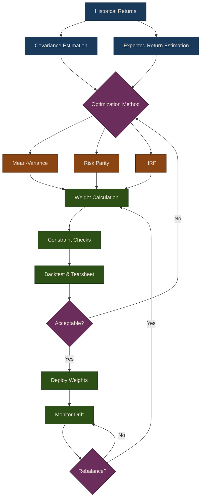

# Portfolio Optimization

## Introduction

Portfolio optimization is the process of selecting the best portfolio allocation from a set of assets, balancing expected returns against risk. This chapter covers modern portfolio theory and advanced techniques for constructing optimal portfolios.

The three core approaches we cover form a natural progression:

1. **Mean-Variance Optimization** -- the classical Markowitz framework that maximizes risk-adjusted returns given expected returns and a covariance matrix
2. **Risk Parity** -- methods that equalize risk contributions across assets rather than optimizing for return
3. **Hierarchical Risk Parity** -- a machine-learning-inspired approach that uses hierarchical clustering to build more stable, estimation-error-resistant portfolios

## Portfolio Optimization Workflow

The following diagram illustrates how raw return data flows through the optimization pipeline to produce a rebalanced portfolio.

## Markowitz Mean-Variance Theory

Harry Markowitz's mean-variance optimization framework forms the foundation of modern portfolio theory. The key insight is that investors should consider both expected returns and the covariance structure of returns when constructing portfolios.

The optimization problem seeks to:
- **Minimize risk** (portfolio variance) for a given level of expected return
- **Maximize return** for a given level of risk
- **Maximize the Sharpe ratio** (risk-adjusted return)

**Mathematical Formulation:**

For a portfolio with weights $w = [w_1, w_2, ..., w_n]$:

- **Portfolio Return**: $R_p = w^T \mu$
- **Portfolio Variance**: $\sigma_p^2 = w^T \Sigma w$
- **Sharpe Ratio**: $SR = \frac{R_p - r_f}{\sigma_p}$

Where:
- $\mu$ = vector of expected returns
- $\Sigma$ = covariance matrix
- $r_f$ = risk-free rate

{: .note }
> Mean-variance optimization is highly sensitive to estimation errors in expected returns. Small changes in return forecasts can produce dramatically different optimal portfolios. The risk parity and HRP approaches in the following sub-pages address this limitation.

## Chapter Contents

| Sub-page | Topics |
|:---------|:-------|
| [Mean-Variance Optimization](01-mean-variance) | Markowitz optimizer, efficient frontier, target-return portfolios |
| [Risk Parity](02-risk-parity) | Equal risk contribution, inverse volatility, maximum diversification |
| [Hierarchical Risk Parity](03-hierarchical-risk-parity) | HRP algorithm, dendrograms, tearsheets, rebalancing strategies |

## Key Takeaways

1. **Mean-Variance Optimization** provides a mathematical framework for portfolio construction but can be sensitive to input estimation errors

2. **Risk Parity** focuses on equal risk contribution rather than equal capital allocation, often leading to better diversification

3. **Hierarchical Risk Parity** combines clustering with risk parity to create more stable portfolios that are robust to estimation errors

4. **Transaction Costs Matter**: Always consider rebalancing costs and implement cost-aware strategies

5. **Multiple Strategies**: Different optimization approaches work better in different market conditions; consider combining strategies or using ensemble approaches

## Further Reading

- Markowitz, H. (1952). ["Portfolio Selection"](https://doi.org/10.2307/2975974). Journal of Finance
- Lopez de Prado, M. (2016). ["Building Diversified Portfolios that Outperform Out of Sample"](https://doi.org/10.3905/jpm.2016.42.4.059)
- Maillard, S., Roncalli, T., & Teiletche, J. (2010). "The Properties of Equally Weighted Risk Contribution Portfolios"

## Next Steps

In the next chapter, we'll explore:
- Black-Litterman model for incorporating views
- Robust portfolio optimization techniques
- Multi-period portfolio optimization
- Factor-based portfolio construction

## Related Chapters

- [Part 4: Alpha Factors]({{ site.baseurl }}/04-alpha-factors/) -- Alpha factor scores determine how capital is allocated across assets
- [Part 7: Backtesting]({{ site.baseurl }}/07-backtesting/) -- Backtesting validates portfolio construction strategies on historical data
- [Part 12: Unsupervised Learning]({{ site.baseurl }}/12-unsupervised-learning/) -- Eigenportfolios and clustering inform portfolio construction
- [Part 24: Risk Management]({{ site.baseurl }}/24-risk-management/) -- Risk constraints bound portfolio weights and limit drawdowns

## Source Code

Browse the implementation: [`puffin/portfolio/`](https://github.com/MichaelTien8901/puffin/tree/main/puffin/portfolio)
