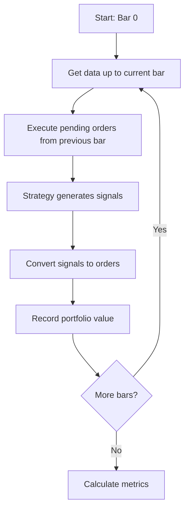

# Backtesting Engine

## Overview

Backtesting lets you test a trading strategy against historical data to estimate how it would have performed. This chapter covers building an event-driven backtester that processes data bar-by-bar, simulates order execution, and calculates performance metrics.

## Why Event-Driven?

There are two approaches to backtesting:

| Approach | Pros | Cons |
|----------|------|------|
| **Vectorized** | Fast, simple | Unrealistic, lookahead bias risk |
| **Event-driven** | Realistic, no lookahead | Slower, more complex |

Puffin uses event-driven backtesting because it mirrors how live trading actually works: you receive a bar, make a decision, submit an order, and it fills on the next bar.

## Basic Usage

```python
from puffin.backtest import Backtester, SlippageModel, CommissionModel
from puffin.strategies import MomentumStrategy

strategy = MomentumStrategy(short_window=20, long_window=50)

bt = Backtester(
    initial_capital=100_000,
    slippage=SlippageModel(fixed=0.01),
    commission=CommissionModel(flat=1.0),
)

result = bt.run(strategy, data)
print(result.metrics())
```

## Execution Flow



{: .important }
Orders generated on bar T execute on bar T+1. The strategy only sees data up to bar T. This prevents lookahead bias.

## Slippage and Commission Models

### Slippage

```python
# Fixed slippage: $0.01 per share
SlippageModel(fixed=0.01)

# Percentage slippage: 0.1% of price
SlippageModel(pct=0.001)

# Combined
SlippageModel(fixed=0.005, pct=0.0005)
```

### Commission

```python
# Flat fee per order
CommissionModel(flat=5.0)

# Per-share fee
CommissionModel(per_share=0.005)

# Percentage of trade value
CommissionModel(pct=0.001)
```

{: .tip }
Start with `SlippageModel(fixed=0.01)` and `CommissionModel(flat=1.0)` as reasonable defaults for US equities.

## Performance Metrics

After a backtest, call `result.metrics()`:

```python
metrics = result.metrics()
# {
#     'total_return': 0.15,
#     'annualized_return': 0.12,
#     'annualized_volatility': 0.18,
#     'sharpe_ratio': 1.2,
#     'max_drawdown': -0.08,
#     'win_rate': 0.55,
#     'profit_factor': 1.8,
#     'total_trades': 42,
# }
```

## Visualization

```python
result.plot()  # Equity curve + drawdown chart
```

## Walk-Forward Analysis

Don't just backtest on one period — use walk-forward analysis to test robustness:

```python
from puffin.backtest import walk_forward

results = walk_forward(
    strategy=strategy,
    data=data,
    train_ratio=0.7,
    n_splits=5,
)

for r in results:
    train_sharpe = r['train_metrics']['sharpe_ratio']
    test_sharpe = r['test_metrics']['sharpe_ratio']
    print(f"Split {r['split']}: Train Sharpe={train_sharpe:.2f}, Test Sharpe={test_sharpe:.2f}")
```

{: .warning }
If your strategy performs well in-sample but poorly out-of-sample, it's likely overfit to historical data. Walk-forward analysis helps detect this.

## Exercises

1. Backtest the momentum strategy on SPY from 2018–2024 with different MA windows
2. Compare results with and without slippage/commission — how much do costs matter?
3. Run walk-forward analysis with 5 splits. Is performance consistent across splits?

## Summary

- Event-driven backtesting prevents lookahead bias by processing bars sequentially
- Always model slippage and commissions — they significantly impact results
- Key metrics: Sharpe ratio, max drawdown, win rate, profit factor
- Walk-forward analysis tests strategy robustness across time periods
- Visualize equity curves and drawdowns to understand strategy behavior

## Source Code

Browse the implementation: [`puffin/backtest/`](https://github.com/MichaelTien8901/puffin/tree/main/puffin/backtest)

## Next Steps

In Part 5, we'll apply **machine learning** to generate trading signals.
