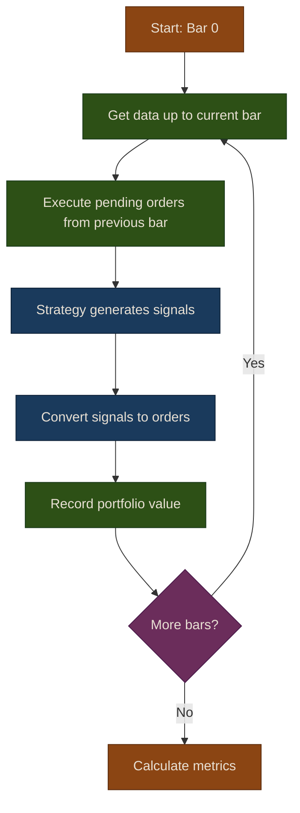

# Part 7: Backtesting

Backtesting lets you test a trading strategy against historical data to estimate how it would have performed. This part covers building an event-driven backtester that processes data bar-by-bar, simulates order execution with realistic slippage and commission models, and calculates performance metrics. We also introduce walk-forward analysis to guard against overfitting.

## Chapters

1. [Event-Driven Engine](01-event-driven-engine) -- Event-driven vs vectorized approaches, execution flow, and basic usage
2. [Execution Models](02-execution-models) -- Slippage models, commission models, and performance metrics
3. [Walk-Forward Analysis](03-walk-forward-analysis) -- Rolling train/test splits, visualization, and overfitting pitfalls

## Execution Flow

The diagram below shows how Puffin's backtester processes each bar. Orders generated on one bar execute on the next, ensuring the strategy never sees future data.

{: .tip }
> **Notebook**: Run the examples interactively in [`operational.ipynb`](https://github.com/MichaelTien8901/puffin/blob/main/notebooks/operational.ipynb)

## Related Chapters

- [Part 2: Data Pipeline]({{ site.baseurl }}/02-data-pipeline/) -- Provides the market data feeds that the backtester consumes bar-by-bar
- [Part 6: Strategy Modules]({{ site.baseurl }}/06-trading-strategies/) -- Defines the strategies that backtesting evaluates against historical data
- [Part 24: Risk Management]({{ site.baseurl }}/24-risk-management/) -- Position sizing and stop-loss rules applied during backtest execution
- [Part 8: Linear Models]({{ site.baseurl }}/08-linear-models/) -- Evaluate linear model predictions in a realistic backtest setting
- [Part 25: Monitoring & Analytics]({{ site.baseurl }}/25-monitoring-analytics/) -- Performance dashboards that visualize backtest results

## Source Code

Browse the implementation: [`puffin/backtest/`](https://github.com/MichaelTien8901/puffin/tree/main/puffin/backtest)
