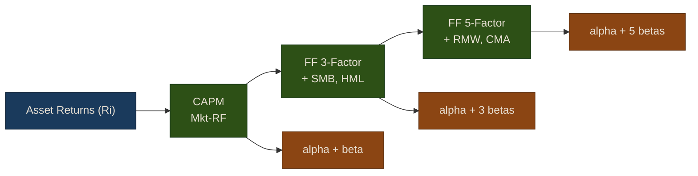

# Fama-French Factor Models

Factor models are the backbone of modern portfolio management. They decompose asset returns into exposures to systematic risk factors, allowing portfolio managers to understand *why* a portfolio performs the way it does. This section covers the Capital Asset Pricing Model (CAPM) through the Fama-French five-factor model, Fama-MacBeth cross-sectional regression, and portfolio attribution.

## Capital Asset Pricing Model (CAPM)

CAPM is the simplest factor model, relating an asset's expected excess return to its exposure to market risk:

```
E[Ri - Rf] = alpha + beta * E[Rm - Rf]
```

Where:
- **Ri**: Asset return
- **Rf**: Risk-free rate
- **Rm**: Market return
- **beta**: Systematic risk (market sensitivity)
- **alpha**: Jensen's alpha (excess return not explained by market risk)

{: .note }
> A positive and statistically significant alpha means the asset is generating returns beyond what its market risk exposure would predict. This is the "holy grail" of active management -- persistent alpha after controlling for systematic risk.

### Factor Model Hierarchy



### Fitting CAPM

```python
from puffin.models.factor_models import FamaFrenchModel
from puffin.data import YFinanceProvider
import pandas as pd

# Initialize model
ff_model = FamaFrenchModel()

# Get asset returns
symbol = 'AAPL'
df = YFinanceProvider().fetch(symbol, start='2020-01-01', end='2023-12-31')
asset_returns = df['close'].pct_change().dropna()

# Fit CAPM
capm_results = ff_model.fit_capm(
    returns=asset_returns,
    start='2020-01-01',
    end='2023-12-31'
)

print("CAPM Results:")
print(f"Alpha: {capm_results['alpha']:.6f} (p={capm_results['alpha_pvalue']:.4f})")
print(f"Beta: {capm_results['beta']:.4f} (p={capm_results['beta_pvalue']:.4f})")
print(f"R-squared: {capm_results['r_squared']:.4f}")

# Interpret results
if capm_results['alpha_pvalue'] < 0.05:
    if capm_results['alpha'] > 0:
        print("\nSignificant positive alpha: Outperforming market!")
    else:
        print("\nSignificant negative alpha: Underperforming market.")
else:
    print("\nAlpha not significant: Performance explained by market exposure.")

if capm_results['beta'] > 1:
    print(f"High beta ({capm_results['beta']:.2f}): More volatile than market")
elif capm_results['beta'] < 1:
    print(f"Low beta ({capm_results['beta']:.2f}): Less volatile than market")
```

### Beta Interpretation

| Beta Range | Interpretation | Example Sectors |
|-----------|----------------|-----------------|
| beta > 1.5 | Highly aggressive, amplifies market swings | High-growth tech, biotech |
| 1 < beta < 1.5 | Moderately aggressive | Technology, consumer discretionary |
| beta = 1 | Moves with the market | Broad index ETFs |
| 0.5 < beta < 1 | Defensive, dampens market moves | Utilities, consumer staples |
| beta < 0 | Moves opposite to market (rare) | Certain hedge fund strategies |

{: .warning }
> Beta is not constant over time. A stock's beta can shift due to changes in business model, leverage, or market conditions. Use rolling-window estimation (e.g., 60-day or 252-day windows) to track beta evolution.

## Fama-French Three-Factor Model

The three-factor model extends CAPM by adding size and value factors, capturing two well-documented return anomalies:

```
E[Ri - Rf] = alpha + b1*(Rm - Rf) + b2*SMB + b3*HML
```

Where:
- **Mkt-RF**: Market excess return
- **SMB** (Small Minus Big): Size factor -- small-cap stocks minus large-cap stocks
- **HML** (High Minus Low): Value factor -- high book-to-market (value) stocks minus low book-to-market (growth) stocks

```python
# Fit 3-factor model
ff3_results = ff_model.fit_three_factor(
    returns=asset_returns,
    start='2020-01-01',
    end='2023-12-31'
)

print("Fama-French 3-Factor Results:")
print(f"Alpha: {ff3_results['alpha']:.6f} (p={ff3_results['pvalues']['alpha']:.4f})")
print(f"Market Beta: {ff3_results['beta_mkt']:.4f} (p={ff3_results['pvalues']['Mkt-RF']:.4f})")
print(f"SMB Beta: {ff3_results['beta_smb']:.4f} (p={ff3_results['pvalues']['SMB']:.4f})")
print(f"HML Beta: {ff3_results['beta_hml']:.4f} (p={ff3_results['pvalues']['HML']:.4f})")
print(f"R-squared: {ff3_results['r_squared']:.4f}")
```

{: .tip }
> A positive SMB beta indicates the asset behaves like a small-cap stock (tilted toward small caps). A positive HML beta indicates it behaves like a value stock. These factor exposures help explain why certain stocks outperform in different market environments.

## Fama-French Five-Factor Model

The five-factor model adds profitability and investment factors, providing a more complete picture of systematic risk:

```
E[Ri - Rf] = alpha + b1*(Rm - Rf) + b2*SMB + b3*HML + b4*RMW + b5*CMA
```

Where:
- **RMW** (Robust Minus Weak): Profitability factor -- profitable firms minus unprofitable firms
- **CMA** (Conservative Minus Aggressive): Investment factor -- conservative investors minus aggressive investors

```python
# Fit 5-factor model
ff5_results = ff_model.fit_five_factor(
    returns=asset_returns,
    start='2020-01-01',
    end='2023-12-31'
)

print("Fama-French 5-Factor Results:")
print(f"Alpha: {ff5_results['alpha']:.6f}")
print(f"\nFactor Exposures:")
for factor, beta in ff5_results['betas'].items():
    pval = ff5_results['pvalues'][factor]
    sig = "***" if pval < 0.01 else "**" if pval < 0.05 else "*" if pval < 0.1 else ""
    print(f"  {factor:10s}: {beta:7.4f} {sig}")
print(f"\nR-squared: {ff5_results['r_squared']:.4f}")
print(f"Adjusted R-squared: {ff5_results['adj_r_squared']:.4f}")
```

### Factor Summary

| Factor | Long Leg | Short Leg | Captures |
|--------|----------|-----------|----------|
| Mkt-RF | Market portfolio | Risk-free rate | Equity risk premium |
| SMB | Small-cap stocks | Large-cap stocks | Size premium |
| HML | High B/M (value) | Low B/M (growth) | Value premium |
| RMW | High profitability | Low profitability | Quality premium |
| CMA | Low investment | High investment | Investment premium |

## Portfolio Attribution

Use factor models to understand the sources of portfolio risk and return across multiple assets:

```python
import pandas as pd
import numpy as np

# Multiple assets
symbols = ['AAPL', 'MSFT', 'JPM', 'XOM']
factor_exposures = {}

for symbol in symbols:
    df_asset = get_bars(symbol, start='2020-01-01', end='2023-12-31')
    returns = df_asset['close'].pct_change().dropna()

    results = ff_model.fit_five_factor(returns, start='2020-01-01', end='2023-12-31')
    factor_exposures[symbol] = results['betas']

# Create factor exposure DataFrame
exposure_df = pd.DataFrame(factor_exposures).T
print("\nFactor Exposures by Asset:")
print(exposure_df.round(3))

# Visualize
import matplotlib.pyplot as plt
exposure_df.plot(kind='bar', figsize=(12, 6))
plt.title('Factor Exposures by Asset')
plt.ylabel('Beta')
plt.legend(loc='best')
plt.tight_layout()
plt.savefig('factor_exposures.png')
```

{: .note }
> Portfolio attribution reveals hidden risks. For example, a portfolio that appears well-diversified across sectors may still have concentrated exposure to a single factor (e.g., high market beta or strong value tilt). Factor models make these hidden exposures visible.

## Fama-MacBeth Regression

Fama-MacBeth is a two-step procedure for estimating factor risk premiums in the cross-section. Unlike time-series regressions that analyze one asset at a time, Fama-MacBeth answers the question: **"Are factor exposures rewarded with higher returns across all assets?"**

The procedure:
1. **Time-series regression**: Estimate factor loadings (betas) for each asset
2. **Cross-sectional regression**: At each time period, regress returns on betas across all assets
3. **Average**: Average the cross-sectional coefficients over time to get risk premiums

### Example with Panel Data

```python
from puffin.models.factor_models import fama_macbeth

# Prepare panel data with multiple assets and time periods
panel_data = []

for symbol in ['AAPL', 'MSFT', 'JPM', 'XOM', 'PG', 'JNJ', 'V', 'MA']:
    df_asset = get_bars(symbol, start='2020-01-01', end='2023-12-31')
    df_asset['returns'] = df_asset['close'].pct_change()

    # Calculate factor exposures (from prior period)
    df_asset['beta_mkt'] = df_asset['returns'].rolling(60).cov(market_returns) / market_returns.rolling(60).var()
    df_asset['beta_smb'] = calculate_smb_beta(df_asset)  # Custom function
    df_asset['beta_hml'] = calculate_hml_beta(df_asset)  # Custom function

    df_asset['asset'] = symbol
    df_asset = df_asset.dropna()

    panel_data.append(df_asset[['date', 'asset', 'returns', 'beta_mkt', 'beta_smb', 'beta_hml']])

panel_df = pd.concat(panel_data, ignore_index=True)

# Run Fama-MacBeth
fm_results = fama_macbeth(
    panel_data=panel_df,
    factors=['beta_mkt', 'beta_smb', 'beta_hml'],
    return_col='returns',
    time_col='date',
    asset_col='asset'
)

print("Fama-MacBeth Results:")
print("\nRisk Premiums:")
for factor, premium in fm_results['risk_premiums'].items():
    t_stat = fm_results['t_stats'][factor]
    sig = "***" if abs(t_stat) > 2.58 else "**" if abs(t_stat) > 1.96 else "*" if abs(t_stat) > 1.65 else ""
    print(f"  {factor:15s}: {premium:8.6f} (t={t_stat:6.2f}) {sig}")

print(f"\nAverage R-squared: {fm_results['r_squared']:.4f}")
print(f"Number of periods: {fm_results['n_periods']}")
```

### Interpreting Fama-MacBeth Results

- **Risk Premium**: Expected excess return per unit of factor exposure. A positive, significant risk premium means that factor is compensated in the market.
- **T-statistic**: Statistical significance (|t| > 1.96 for the 5% level). Fama-MacBeth t-statistics use Newey-West standard errors to account for autocorrelation.
- **Cross-sectional R-squared**: How well factors explain return differences across assets at each point in time.

{: .warning }
> Fama-MacBeth regressions require a sufficient number of assets in the cross-section (typically 25+). With only a handful of assets, the cross-sectional regressions will be unreliable.

## Complete Trading Example

This example integrates multiple linear models into a single trading strategy: Ridge regression for return prediction, logistic regression for direction classification, and Fama-French analysis for risk management.

```python
import pandas as pd
import numpy as np
from puffin.data import YFinanceProvider
from puffin.models.linear import RidgeModel, DirectionClassifier
from puffin.models.factor_models import FamaFrenchModel
from puffin.backtest import Backtester
from puffin.strategies import Strategy

class LinearModelStrategy(Strategy):
    """Trading strategy using linear models."""

    def __init__(self, lookback=60, refit_freq=20):
        self.lookback = lookback
        self.refit_freq = refit_freq
        self.return_model = None
        self.direction_model = None
        self.days_since_fit = 0

    def calculate_features(self, df):
        """Calculate technical features."""
        df['momentum_5'] = df['close'].pct_change(5)
        df['momentum_20'] = df['close'].pct_change(20)
        df['rsi'] = self.calculate_rsi(df['close'], 14)
        df['volume_ratio'] = df['volume'] / df['volume'].rolling(20).mean()
        df['volatility'] = df['close'].pct_change().rolling(20).std()
        df['trend'] = (df['close'] / df['close'].rolling(50).mean()) - 1
        return df

    def calculate_rsi(self, prices, period=14):
        """Calculate RSI indicator."""
        delta = prices.diff()
        gain = (delta.where(delta > 0, 0)).rolling(period).mean()
        loss = (-delta.where(delta < 0, 0)).rolling(period).mean()
        rs = gain / loss
        return 100 - (100 / (1 + rs))

    def on_data(self, data):
        """Called on each bar."""
        if len(data) < self.lookback + 30:
            return

        # Calculate features
        df = self.calculate_features(data.copy())
        df = df.dropna()

        if len(df) < self.lookback:
            return

        # Refit models periodically
        self.days_since_fit += 1
        if self.return_model is None or self.days_since_fit >= self.refit_freq:
            self.fit_models(df)
            self.days_since_fit = 0

        # Make predictions
        features = ['momentum_5', 'momentum_20', 'rsi', 'volume_ratio',
                   'volatility', 'trend']
        X_latest = df[features].iloc[-1:].values

        # Predict return magnitude
        pred_return = self.return_model.predict(X_latest)[0]

        # Predict direction probability
        pred_proba = self.direction_model.predict_proba(X_latest)[0, 1]

        # Generate signal
        if pred_proba > 0.55 and pred_return > 0:
            # Strong buy signal
            self.set_position(1.0)
        elif pred_proba < 0.45 and pred_return < 0:
            # Strong sell signal
            self.set_position(-1.0)
        elif pred_proba > 0.52:
            # Weak buy signal
            self.set_position(0.5)
        elif pred_proba < 0.48:
            # Weak sell signal
            self.set_position(-0.5)
        else:
            # No clear signal
            self.set_position(0.0)

    def fit_models(self, df):
        """Fit return and direction models."""
        # Prepare training data
        features = ['momentum_5', 'momentum_20', 'rsi', 'volume_ratio',
                   'volatility', 'trend']

        df['returns'] = df['close'].pct_change()
        df['target_return'] = df['returns'].shift(-1)
        df['target_direction'] = (df['target_return'] > 0).astype(int)

        train_df = df.dropna().iloc[-self.lookback:]
        X_train = train_df[features]
        y_return = train_df['target_return']
        y_direction = train_df['target_direction']

        # Fit return prediction model (Ridge)
        self.return_model = RidgeModel(normalize=True)
        self.return_model.fit(X_train, y_return)

        # Fit direction prediction model (Logistic)
        self.direction_model = DirectionClassifier(
            class_weight='balanced',
            normalize=True
        )
        self.direction_model.fit(X_train, y_direction)

# Run backtest
df = YFinanceProvider().fetch('AAPL', start='2020-01-01', end='2023-12-31')

strategy = LinearModelStrategy(lookback=120, refit_freq=20)
backtest = Backtester(data=df, strategy=strategy, cash=100000)

results = backtest.run()

# Display results
print("\nBacktest Results:")
print(f"Total Return: {results['total_return']:.2%}")
print(f"Sharpe Ratio: {results['sharpe_ratio']:.2f}")
print(f"Max Drawdown: {results['max_drawdown']:.2%}")
print(f"Win Rate: {results['win_rate']:.2%}")
print(f"Total Trades: {results['total_trades']}")

# Compare to buy-and-hold
bh_return = (df['close'].iloc[-1] / df['close'].iloc[0]) - 1
print(f"\nBuy-and-Hold Return: {bh_return:.2%}")
print(f"Excess Return: {results['total_return'] - bh_return:.2%}")

# Plot results
backtest.plot()
```

{: .tip }
> The `LinearModelStrategy` above combines Ridge regression and logistic regression with periodic refitting. In production, you would add Fama-French analysis as a risk overlay -- for example, rejecting long signals when the portfolio's market beta exceeds a threshold, or hedging factor exposures with ETFs.

## Source Code

Browse the implementation: [`puffin/models/`](https://github.com/MichaelTien8901/puffin/tree/main/puffin/models)
