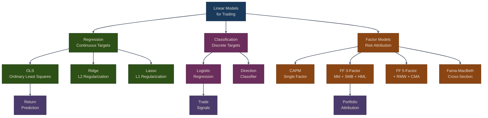

# Linear Models for Trading

Linear models are fundamental tools in quantitative finance, providing interpretable and computationally efficient methods for return prediction, risk analysis, and factor modeling. This chapter covers the application of linear regression techniques to trading strategies.

## Why Linear Models?

Linear models assume that the target variable is a linear combination of input features plus noise:

```
y = b0 + b1*x1 + b2*x2 + ... + bn*xn + e
```

**Advantages:**
- Interpretability: Coefficients directly show feature importance
- Computational efficiency: Fast to train and predict
- Statistical inference: P-values, confidence intervals available
- Well-understood theory: Decades of financial research

{: .note }
> Linear models remain the workhorse of quantitative finance. Even when more complex models are used for prediction, linear factor models are essential for risk management and performance attribution.

## Key Applications in Trading

1. **Return Prediction**: Forecast future returns from technical indicators and fundamentals
2. **Factor Analysis**: Decompose returns into systematic risk factors
3. **Direction Classification**: Predict up/down movements for directional strategies
4. **Risk Attribution**: Understand sources of portfolio risk

## Linear Models Taxonomy



## Chapter Outline

| Section | Topics | Key Classes |
|---------|--------|-------------|
| [OLS, Ridge & Lasso](01-ols-ridge-lasso) | Regression for return prediction, regularization, model comparison | `OLSModel`, `RidgeModel`, `LassoModel` |
| [Logistic Regression](02-logistic-regression) | Direction prediction, probability-based trading signals | `DirectionClassifier` |
| [Fama-French Factor Models](03-fama-french) | CAPM, 3/5-factor models, Fama-MacBeth regression, attribution | `FamaFrenchModel`, `fama_macbeth` |

## Key Takeaways

1. **Linear models provide interpretability** -- Understand which features drive returns
2. **Regularization prevents overfitting** -- Use Ridge/Lasso with many features
3. **Direction prediction differs from return prediction** -- Logistic regression for classification
4. **Factor models explain systematic risk** -- CAPM and Fama-French decompose returns
5. **Statistical significance matters** -- Check p-values before trusting results
6. **Refit models periodically** -- Market dynamics change over time
7. **Combine predictions** -- Use both magnitude and direction for better signals
8. **Monitor residuals** -- Ensure model assumptions hold

## Next Steps

- **Part 9: Time Series Models** -- ARIMA, GARCH, state-space models
- **Part 10: Machine Learning** -- Non-linear models, ensemble methods
- **Part 11: Deep Learning** -- Neural networks for trading

{: .tip }
> **Notebook**: Run the examples interactively in [`ml_models.ipynb`](https://github.com/MichaelTien8901/puffin/blob/main/notebooks/ml_models.ipynb)

## Related Chapters

- [Part 4: Alpha Factors]({{ site.baseurl }}/04-alpha-factors/) -- Alpha factors serve as input features for linear return-prediction models
- [Part 9: Time Series Models]({{ site.baseurl }}/09-time-series-models/) -- Extends linear regression to autoregressive and volatility models
- [Part 11: Tree Ensembles]({{ site.baseurl }}/11-tree-ensembles/) -- Non-linear alternative when linear assumptions do not hold
- [Part 10: Bayesian ML]({{ site.baseurl }}/10-bayesian-ml/) -- Bayesian approach to parameter uncertainty in linear factor models
- [Part 7: Backtesting]({{ site.baseurl }}/07-backtesting/) -- Evaluate linear model predictions in a realistic backtest environment

## References

- Fama, E. F., & French, K. R. (1993). [Common risk factors in the returns on stocks and bonds](https://doi.org/10.1016/0304-405X(93)90023-5). *Journal of Financial Economics*.
- Fama, E. F., & MacBeth, J. D. (1973). [Risk, return, and equilibrium: Empirical tests](https://doi.org/10.1086/260061). *Journal of Political Economy*.
- Campbell, J. Y., Lo, A. W., & MacKinlay, A. C. (1997). *The Econometrics of Financial Markets*. Princeton University Press.

## Source Code

Browse the implementation: [`puffin/models/`](https://github.com/MichaelTien8901/puffin/tree/main/puffin/models)
