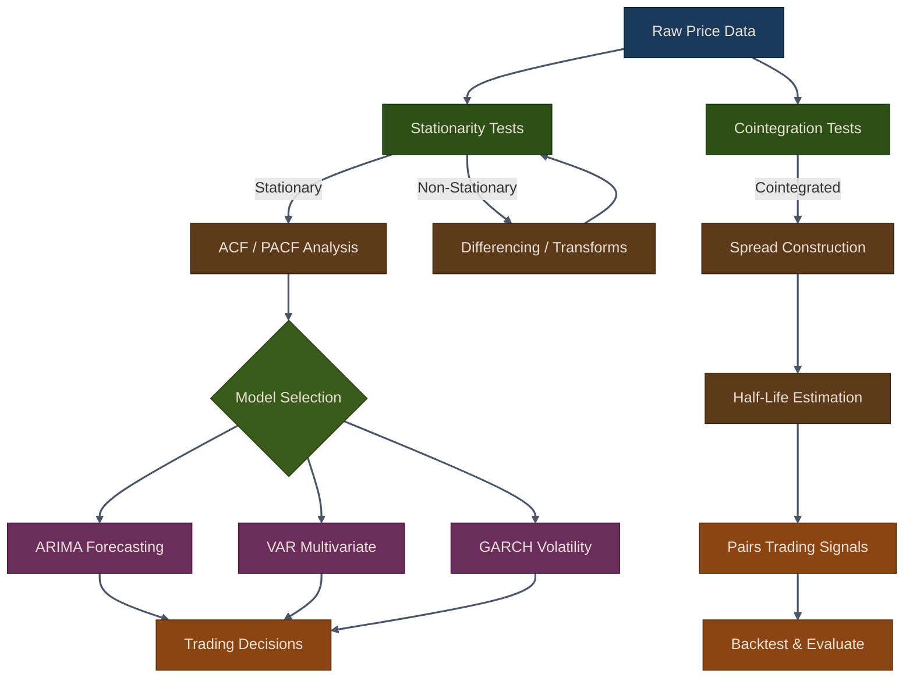

# Time Series Models for Trading

Time series models are essential tools for analyzing and forecasting financial data. This chapter covers key time series techniques for algorithmic trading, including stationarity testing, ARIMA, VAR, GARCH, cointegration, and pairs trading strategies.

## Chapter Overview

Time series analysis provides the statistical foundation for understanding price dynamics, forecasting returns, modeling volatility, and identifying mean-reverting relationships between assets. These techniques are critical building blocks for quantitative trading strategies.

| Sub-page | Topics Covered |
|:---------|:---------------|
| [Diagnostics & Stationarity](01-diagnostics-stationarity) | ADF test, KPSS test, decomposition, autocorrelation |
| [ARIMA, VAR & GARCH](02-arima-var-garch) | ARIMA forecasting, VAR multivariate models, GARCH volatility |
| [Cointegration & Pairs Trading](03-cointegration-pairs-trading) | Engle-Granger, Johansen test, spread analysis, pairs strategy |

## Time Series Analysis Workflow

## Key Concepts

{: .note }
> Most time series models assume **stationarity** -- statistical properties that do not change over time. Always test for stationarity before fitting models like ARIMA or VAR.

### Why Time Series Models Matter for Trading

- **Forecasting returns**: ARIMA and VAR models provide statistical forecasts that can inform trading signals.
- **Volatility modeling**: GARCH models capture volatility clustering and enable better risk management.
- **Statistical arbitrage**: Cointegration analysis identifies pairs of assets whose price spread is mean-reverting, forming the basis of pairs trading.
- **Regime detection**: Time series diagnostics help identify structural breaks and regime changes in market behavior.

## Key Takeaways

1. **Stationarity is fundamental**: Always test for stationarity before applying time series models.
2. **ARIMA for forecasting**: Use ARIMA models to forecast univariate time series. Auto-selection helps find optimal parameters.
3. **VAR for multivariate analysis**: VAR models capture relationships between multiple time series and test for Granger causality.
4. **GARCH for volatility**: GARCH models are essential for volatility forecasting and risk management.
5. **Cointegration for pairs trading**: Cointegration identifies pairs with long-term equilibrium relationships suitable for statistical arbitrage.
6. **Mean reversion**: Pairs trading exploits mean reversion in spreads between cointegrated assets.
7. **Half-life matters**: Shorter half-lives indicate faster mean reversion and more trading opportunities.
8. **Risk management**: Always include transaction costs and use proper position sizing in pairs trading.

## Next Steps

- Explore advanced time series models (state-space models, regime-switching models)
- Implement dynamic hedge ratio estimation
- Add risk management layers (stop-loss, position limits)
- Develop multi-pair portfolio optimization
- Integrate with live trading systems

{: .tip }
> **Notebook**: Run the examples interactively in [`ml_models.ipynb`](https://github.com/MichaelTien8901/puffin/blob/main/notebooks/ml_models.ipynb)

## Related Chapters

- [Part 8: Linear Models]({{ site.baseurl }}/08-linear-models/) -- Provides the linear regression foundation that ARIMA and VAR extend
- [Part 10: Bayesian ML]({{ site.baseurl }}/10-bayesian-ml/) -- Bayesian approach to time series parameter estimation and volatility modeling
- [Part 4: Alpha Factors]({{ site.baseurl }}/04-alpha-factors/) -- Factor engineering techniques that feed into time series forecasting models
- [Part 18: RNNs for Trading]({{ site.baseurl }}/18-rnns-for-trading/) -- RNNs extend classical time series methods with deep sequential modeling

## Source Code

Browse the implementation: [`puffin/models/`](https://github.com/MichaelTien8901/puffin/tree/main/puffin/models)

For more details, see the [Puffin repository](https://github.com/MichaelTien8901/puffin) and explore the examples in the repository.
