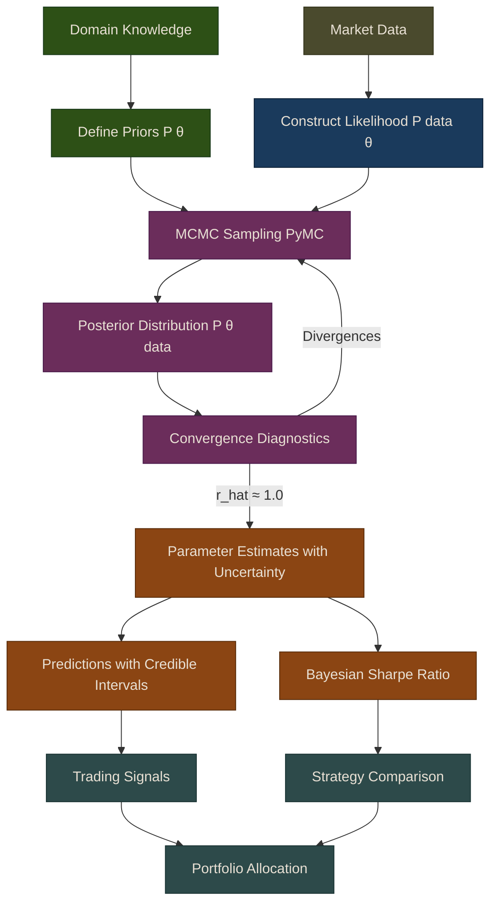

# Bayesian Machine Learning for Trading

Bayesian methods provide a principled framework for incorporating uncertainty into trading decisions. Unlike traditional frequentist approaches that provide point estimates, Bayesian inference gives us full probability distributions over parameters and predictions, allowing for better risk management and decision-making under uncertainty.

{: .note }
> This chapter covers PyMC fundamentals, Bayesian strategy evaluation, and stochastic volatility models -- all essential tools for uncertainty-aware algorithmic trading.

## Introduction to Bayesian Inference

Bayesian inference is based on Bayes' theorem:

```
P(θ|data) = P(data|θ) × P(θ) / P(data)
```

Where:
- **P(θ\|data)** is the **posterior**: what we learn about parameters θ after seeing the data
- **P(data\|θ)** is the **likelihood**: how probable the data is given parameters θ
- **P(θ)** is the **prior**: our beliefs about θ before seeing the data
- **P(data)** is the **evidence**: normalizing constant

### Why Bayesian Methods for Trading?

1. **Uncertainty Quantification**: Get probability distributions, not just point estimates
2. **Incorporate Prior Knowledge**: Use domain expertise through informative priors
3. **Robust to Overfitting**: Bayesian regularization naturally prevents overfitting
4. **Adaptive Learning**: Update beliefs as new data arrives
5. **Better Risk Management**: Understand full distribution of possible outcomes

## Bayesian Inference Workflow

The following diagram shows the end-to-end Bayesian inference pipeline as implemented in Puffin's `puffin.models.bayesian` and `puffin.models.stochastic_vol` modules.



## Chapter Contents

| Sub-Page | Topics |
|----------|--------|
| [PyMC Fundamentals](01-pymc-fundamentals) | Bayesian inference intro, PyMC basics, Bayesian linear regression, factor models |
| [Bayesian Sharpe Ratio](02-bayesian-sharpe) | Bayesian Sharpe ratio, strategy comparison with uncertainty |
| [Stochastic Volatility](03-stochastic-volatility) | Dynamic hedge ratios, stochastic vol models, practical trading examples |

## Key Implementations in Puffin

- `BayesianLinearRegression`: Factor models with uncertainty
- `bayesian_sharpe()`: Robust strategy evaluation
- `compare_strategies_bayesian()`: Principled strategy ranking
- `BayesianPairsTrading`: Dynamic hedge ratios for pairs trading
- `StochasticVolatilityModel`: Time-varying latent volatility
- `estimate_volatility_regime()`: Quick volatility regime detection

## Summary

Bayesian methods provide powerful tools for trading:

1. **Uncertainty Quantification**: Full probability distributions enable better risk management
2. **Adaptive Learning**: Update beliefs as new data arrives
3. **Robust Inference**: Handle outliers and fat tails naturally
4. **Principled Comparison**: Compare strategies accounting for estimation uncertainty

{: .tip }
> **Notebook**: Run the examples interactively in [`ml_models.ipynb`](https://github.com/MichaelTien8901/puffin/blob/main/notebooks/ml_models.ipynb)

## Related Chapters

- [Part 9: Time Series Models]({{ site.baseurl }}/09-time-series-models/) -- Bayesian methods naturally extend time series models with uncertainty estimates
- [Part 8: Linear Models]({{ site.baseurl }}/08-linear-models/) -- Linear regression provides the foundation for Bayesian linear factor models
- [Part 24: Risk Management]({{ site.baseurl }}/24-risk-management/) -- Posterior distributions from Bayesian inference inform position sizing and risk controls

## Source Code

Browse the implementation: [`puffin/models/`](https://github.com/MichaelTien8901/puffin/tree/main/puffin/models)

## Further Reading

- [*Bayesian Methods for Hackers*](https://github.com/CamDavidsonPilon/Probabilistic-Programming-and-Bayesian-Methods-for-Hackers) by Cameron Davidson-Pilon
- [*Statistical Rethinking*](https://xcelab.net/rm/statistical-rethinking/) by Richard McElreath
- [PyMC Documentation](https://www.pymc.io/)
- [ArviZ Documentation](https://arviz-devs.github.io/arviz/)
- "Bayesian Methods in Finance" by Rachev et al.
