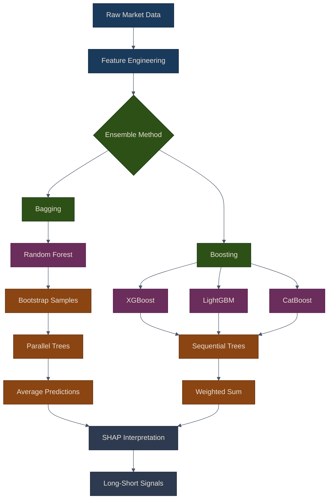

# Tree Ensembles for Trading

Tree ensemble methods combine multiple decision trees to create powerful, robust predictive models. These methods are particularly effective for trading applications due to their ability to capture non-linear patterns, handle mixed data types, and provide interpretable feature importances.

## Why Tree Ensembles for Trading?

Tree ensemble methods offer several advantages for financial prediction:

1. **Non-linear pattern recognition**: Capture complex relationships between features and returns
2. **Feature interactions**: Automatically discover interactions between technical and fundamental factors
3. **Robustness**: Less sensitive to outliers than linear models
4. **Mixed data types**: Handle both numerical and categorical features
5. **Feature importance**: Provide interpretable insights into what drives predictions
6. **No feature scaling required**: Trees are invariant to monotonic transformations

{: .note }
> Tree ensembles consistently rank among the top-performing algorithms in financial ML competitions and production trading systems. Their ability to handle noisy, non-stationary data makes them particularly well-suited to market prediction tasks.

## Ensemble Methods Taxonomy

The following diagram illustrates the two primary families of ensemble methods and how they are applied in a trading pipeline:



## Chapter Overview

This chapter covers four key topics:

| Sub-page | Topics |
|:---------|:-------|
| [Random Forests](01-random-forests) | Decision trees review, `RandomForestTrader`, bootstrap aggregation, hyperparameter tuning |
| [Gradient Boosting](02-gradient-boosting) | XGBoost, LightGBM, CatBoost implementations, sequential training, parameter grids |
| [SHAP Interpretation](03-shap-interpretation) | SHAP values, summary/dependence/waterfall plots, cross-model feature importance comparison |
| [Long-Short Strategy](04-long-short-strategy) | `EnsembleLongShort`, backtesting, complete multi-asset example, best practices |

## Two Families of Ensembles

### Bagging (Bootstrap Aggregation)

Bagging reduces **variance** by training many independent models on bootstrap samples and averaging their predictions. Random Forests are the canonical example: each tree sees a different subset of rows and features, making the ensemble far more stable than any single tree.

### Boosting (Sequential Error Correction)

Boosting reduces **bias** by training models sequentially, where each new model focuses on the errors of the previous ones. Gradient boosting frameworks (XGBoost, LightGBM, CatBoost) dominate structured-data competitions and production systems because they achieve high accuracy with relatively few trees.

{: .important }
> For financial data, gradient boosting models typically outperform Random Forests in raw accuracy, but Random Forests provide a more robust baseline with less tuning. A prudent approach is to train both and combine them in an ensemble strategy.

## Quick Start

```python
from puffin.ensembles import (
    RandomForestTrader,
    XGBoostTrader,
    LightGBMTrader,
    CatBoostTrader,
    ModelInterpreter,
    EnsembleLongShort,
)
```

All ensemble models in Puffin follow the same interface:

1. Initialize with `task="classification"` or `task="regression"`
2. Call `.fit(features, target)` to train
3. Call `.predict(features)` to generate predictions
4. Call `.feature_importance()` for built-in importance scores
5. Use `ModelInterpreter` for SHAP-based analysis

## Summary

Tree ensemble methods provide powerful tools for trading signal generation:

- **Random Forests** offer robustness through bagging
- **Gradient boosting** (XGBoost, LightGBM, CatBoost) provides state-of-the-art accuracy
- **SHAP values** enable model interpretation and feature analysis
- **Ensemble strategies** combine multiple models for improved performance

The combination of high predictive power, interpretability, and robustness makes tree ensembles essential tools for quantitative trading.

## Related Chapters

- [Part 8: Linear Models]({{ site.baseurl }}/08-linear-models/) -- Linear models provide the interpretable baseline that tree ensembles aim to improve upon
- [Part 12: Unsupervised Learning]({{ site.baseurl }}/12-unsupervised-learning/) -- PCA and clustering produce features and asset groups that tree models consume
- [Part 4: Alpha Factors]({{ site.baseurl }}/04-alpha-factors/) -- Alpha factors serve as the primary input features for ensemble classifiers
- [Part 7: Backtesting]({{ site.baseurl }}/07-backtesting/) -- Backtest long-short signals generated by tree ensemble predictions

## Source Code

Browse the implementation: [`puffin/ensembles/`](https://github.com/MichaelTien8901/puffin/tree/main/puffin/ensembles)

## Further Reading

- Friedman, J. H. (2001). "Greedy function approximation: A gradient boosting machine."
- [Breiman, L. (2001). "Random forests."](https://doi.org/10.1023/A:1010933404324)
- [Chen, T., & Guestrin, C. (2016). "XGBoost: A scalable tree boosting system."](https://doi.org/10.1145/2939672.2939785)
- [Ke, G., et al. (2017). "LightGBM: A highly efficient gradient boosting decision tree."](https://papers.nips.cc/paper/2017/hash/6449f44a102fde848669bdd9eb6b76fa-Abstract.html)
- [Prokhorenkova, L., et al. (2018). "CatBoost: unbiased boosting with categorical features."](https://arxiv.org/abs/1706.09516)
- [Lundberg, S. M., & Lee, S. I. (2017). "A unified approach to interpreting model predictions."](https://arxiv.org/abs/1705.07874)
