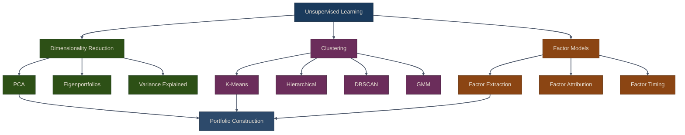

# Unsupervised Learning for Trading

## Overview

Unsupervised learning discovers hidden patterns in data without labeled targets. In trading, it helps with:

- **Dimensionality reduction**: PCA identifies dominant market factors
- **Asset grouping**: Clustering finds assets with similar behavior
- **Risk factor extraction**: Data-driven alternatives to traditional factor models
- **Regime detection**: Identifying market states automatically

Unlike supervised learning, unsupervised methods don't predict future values directly. Instead, they reveal structure that informs portfolio construction and risk management.

{: .note }
> Chapter 13 of *Machine Learning for Algorithmic Trading* covers PCA, clustering, eigenportfolios,
> and hierarchical risk parity. This part implements those techniques in the `puffin.unsupervised` module.

## Methods Taxonomy

## Chapter Contents

| Sub-page | Topics |
|---|---|
| [PCA & Eigenportfolios](01-pca-eigenportfolios) | Principal component analysis, variance explained, eigenportfolios, return reconstruction |
| [Clustering Methods](02-clustering-methods) | K-means, hierarchical clustering, DBSCAN, Gaussian mixture models, cluster correlation |
| [Data-Driven Risk Factors](03-data-driven-risk-factors) | Factor extraction, exposures, attribution, variance decomposition, mimicking portfolios, factor timing |

## Common Pitfalls

{: .warning }
> Keep these in mind when applying unsupervised methods to financial data.

1. **Overfitting with too many components**: Use explained variance threshold (e.g., 95%) rather than arbitrary numbers.

2. **Ignoring time structure**: PCA treats all observations equally. For time series, consider rolling windows or exponential weighting.

3. **Interpreting PCA factors**: Principal components are linear combinations of assets. They're mathematically optimal but not always economically meaningful.

4. **Cluster instability**: Small changes in data can flip cluster labels. Use hierarchical clustering or GMM for more stable results.

5. **Correlation vs causation**: Clustering finds correlation, not causation. Assets may cluster due to omitted variables.

## Exercises

1. Load S&P 500 returns and apply PCA. How many components explain 90% of variance?

2. Cluster tech stocks (AAPL, GOOGL, MSFT, etc.) using k-means. Do the clusters make sense?

3. Extract 3 data-driven risk factors from a portfolio. What percentage of variance is factor vs specific?

4. Use DBSCAN to find outlier assets in a sector. Which stocks are flagged?

5. Construct a factor-mimicking portfolio for the first principal component. How does it compare to equal-weighted?

## Summary

- **PCA** reduces dimensionality and identifies dominant market modes
- **Eigenportfolios** provide interpretable portfolios from principal components
- **K-means** groups assets with similar behavior
- **Hierarchical clustering** reveals asset relationships via dendrograms
- **DBSCAN** finds irregular clusters and outliers
- **GMM** provides soft cluster membership probabilities
- **Data-driven factors** extract risk factors directly from returns
- **Factor attribution** decomposes returns into common and specific components

Unsupervised learning complements supervised models by revealing structure in unlabeled data. Use it for portfolio construction, risk management, and regime detection.

{: .tip }
> **Notebook**: Run the examples interactively in [`ml_models.ipynb`](https://github.com/MichaelTien8901/puffin/blob/main/notebooks/ml_models.ipynb)

## Related Chapters

- [Part 11: Tree Ensembles]({{ site.baseurl }}/11-tree-ensembles/) -- Tree models consume PCA-reduced features and cluster labels as inputs
- [Part 4: Alpha Factors]({{ site.baseurl }}/04-alpha-factors/) -- PCA and clustering reduce the high-dimensional factor space to its dominant drivers
- [Part 5: Portfolio Optimization]({{ site.baseurl }}/05-portfolio-optimization/) -- Eigenportfolios and clustering feed directly into portfolio construction methods
- [Part 19: Autoencoders]({{ site.baseurl }}/19-autoencoders/) -- Autoencoders extend unsupervised dimensionality reduction with neural networks

## Source Code

Browse the implementation: [`puffin/unsupervised/`](https://github.com/MichaelTien8901/puffin/tree/main/puffin/unsupervised)

## Next Steps

Part 13 explores **NLP for trading**: sentiment analysis, news processing, and text-based signals.
