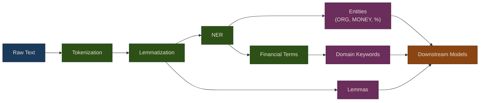

# NLP Pipeline & Tokenization

Text preprocessing is the foundation of any NLP-for-trading system. Raw news articles, earnings transcripts, and SEC filings must be cleaned, tokenized, and annotated before they can produce useful trading signals. The `NLPPipeline` class handles all of this using spaCy, with automatic fallback if spaCy is unavailable.

## Basic Usage

```python
from puffin.nlp import NLPPipeline

# Initialize pipeline
pipeline = NLPPipeline()

# Process text
text = "Apple Inc. reported Q3 earnings of $19.4B, up 8% YoY."
doc = pipeline.process(text)

# Access linguistic features
print(doc.tokens)
# ['Apple', 'Inc.', 'reported', 'Q3', 'earnings', ...]

print(doc.lemmas)
# ['apple', 'inc.', 'report', 'q3', 'earnings', ...]

print(doc.entities)
# [('Apple Inc.', 'ORG'), ('Q3', 'DATE'), ('$19.4B', 'MONEY'), ('8%', 'PERCENT')]

print(doc.sentences)
# ['Apple Inc. reported Q3 earnings of $19.4B, up 8% YoY.']
```

{: .note }
> The `process()` method returns a document object with `tokens`, `lemmas`, `entities`, and `sentences` attributes. Lemmatization reduces words to their base form (e.g., "reported" becomes "report"), which helps group related terms together for downstream analysis.

## NLP Pipeline Flow



## Named Entity Recognition for Finance

Named Entity Recognition (NER) identifies structured information in unstructured text. For financial analysis, the most relevant entity types are organizations, monetary values, percentages, and dates.

```python
# Focus on ORG, MONEY, PERCENT, DATE entities
entities = pipeline.extract_entities(text)

for entity_text, entity_label in entities:
    print(f"{entity_label}: {entity_text}")
# ORG: Apple Inc.
# DATE: Q3
# MONEY: $19.4B
# PERCENT: 8%
```

### Why NER Matters for Trading

Entity extraction enables several trading-relevant workflows:

- **Company attribution**: Link sentiment scores to the correct ticker symbol
- **Monetary extraction**: Pull out revenue figures, earnings per share, and price targets
- **Date extraction**: Identify forward-looking dates for guidance and earnings forecasts
- **Relationship mapping**: Build knowledge graphs of companies mentioned together

{: .important }
> spaCy's default NER model works well for general entities but may miss financial-specific patterns like ticker symbols (AAPL) or non-standard monetary formats (19.4B). For production use, consider fine-tuning the NER model on financial text.

## Extract Financial Terms

The `extract_financial_terms` method identifies trading and finance keywords that carry signal value. This is distinct from NER -- it captures domain-specific vocabulary rather than named entities.

```python
text = "The stock rallied on strong earnings, with analysts raising price targets."
terms = pipeline.extract_financial_terms(text)

print(terms)
# ['stock', 'rallied', 'earnings', 'analysts']
```

Financial term extraction is useful for:

- **Feature engineering**: Count domain-relevant terms per document as ML features
- **Filtering**: Discard articles with no financial terms (off-topic noise)
- **Weighting**: Upweight documents with high financial term density

## Batch Processing

When processing large collections of documents (e.g., a day's worth of news articles), use `batch_process` for efficiency. It processes multiple documents in a single pass, leveraging spaCy's internal batching.

```python
texts = [
    "Tesla shares gained 5% on delivery beat.",
    "Microsoft cloud revenue grew 20% YoY.",
    "Amazon acquired robotics startup.",
]

docs = pipeline.batch_process(texts)

for doc in docs:
    print(f"Tokens: {len(doc.tokens)}, Entities: {len(doc.entities)}")
```

### Processing at Scale

For large-scale processing (thousands of articles), consider chunking your input:

```python
import itertools

def chunked(iterable, size):
    """Split iterable into chunks of given size."""
    it = iter(iterable)
    while True:
        chunk = list(itertools.islice(it, size))
        if not chunk:
            break
        yield chunk

# Process 10,000 articles in batches of 500
all_docs = []
for batch in chunked(all_articles, 500):
    batch_docs = pipeline.batch_process(batch)
    all_docs.extend(batch_docs)
```

## Preprocessing Best Practices for Financial Text

### Financial-Specific Stopwords

Standard NLP stopword lists remove common words, but financial text requires a custom approach:

```python
# Use financial stopwords
financial_stopwords = {
    'inc', 'corp', 'ltd', 'co', 'llc',  # Company suffixes
    'said', 'according', 'reported',     # Common verbs
}

# Keep domain terms that general stopwords remove
keep_words = {
    'up', 'down', 'above', 'below',     # Direction words
    'more', 'less', 'most', 'least',    # Comparison
}
```

{: .warning }
> Do not blindly apply general-purpose stopword lists to financial text. Words like "up," "down," "above," and "below" are critical directional signals that standard stopword lists would remove.

### Entity-Specific Analysis

Analyze sentiment per company by combining NER with downstream scoring:

```python
import numpy as np

def entity_sentiment(articles, pipeline, sentiment):
    entity_scores = {}

    for article in articles:
        # Extract organizations
        entities = pipeline.extract_entities(article)
        orgs = [e[0] for e in entities if e[1] == 'ORG']

        # Compute sentiment
        score = sentiment.score(article)

        # Attribute to each mentioned org
        for org in orgs:
            if org not in entity_scores:
                entity_scores[org] = []
            entity_scores[org].append(score)

    # Average per entity
    return {
        org: np.mean(scores)
        for org, scores in entity_scores.items()
    }
```

## Source Code

Browse the implementation: [`puffin/nlp/`](https://github.com/MichaelTien8901/puffin/tree/main/puffin/nlp)

## Next Steps

Continue to [Bag-of-Words & TF-IDF](02-bag-of-words-tfidf) to learn how to convert preprocessed text into numerical feature vectors suitable for machine learning.
