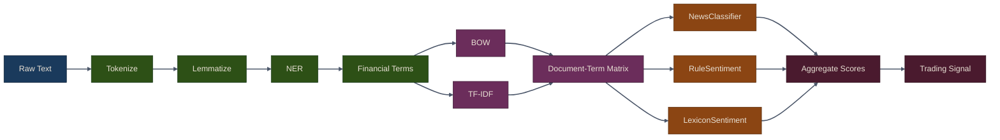

# NLP for Trading

## Overview

Natural Language Processing (NLP) extracts signals from unstructured text like news articles, earnings call transcripts, SEC filings, and social media. Unlike numerical data, text requires specialized techniques for tokenization, feature extraction, and sentiment analysis.

In trading, NLP helps with:

- **Sentiment analysis**: Gauge market mood from news and social media
- **Event detection**: Identify significant corporate events from filings
- **Topic modeling**: Track evolving themes in earnings calls
- **Classification**: Categorize news as bullish, bearish, or neutral
- **Named entity recognition**: Extract company names, money amounts, dates

The Puffin NLP module provides financial-specific tools tuned for trading applications, not general-purpose text analysis.

## NLP Pipeline Architecture

The following diagram shows how raw text flows through the Puffin NLP pipeline, from ingestion to a trading signal:



## Chapter Sections

This chapter is organized into three sections that build on each other:

| Section | Topic | Key Classes |
|---------|-------|-------------|
| [NLP Pipeline & Tokenization](01-nlp-pipeline-tokenization) | Text preprocessing, NER, financial term extraction | `NLPPipeline` |
| [Bag-of-Words & TF-IDF](02-bag-of-words-tfidf) | Text vectorization and document-term matrices | `build_bow`, `build_tfidf`, `DocumentTermMatrix` |
| [Sentiment Classification](03-sentiment-classification) | News classification and lexicon-based sentiment | `NewsClassifier`, `RuleSentiment`, `LexiconSentiment` |

## Key Concepts

{: .note }
> NLP for trading differs from general NLP in important ways. Financial text has domain-specific vocabulary (e.g., "liability" is negative in finance but neutral in general usage), and models must be tuned for the financial domain to produce reliable signals.

### From Text to Signal

The typical NLP-for-trading workflow follows these stages:

1. **Ingest** -- Collect raw text from news feeds, SEC filings, earnings transcripts, or social media
2. **Preprocess** -- Tokenize, lemmatize, extract named entities and financial terms
3. **Vectorize** -- Convert cleaned text into numerical features (BOW, TF-IDF)
4. **Classify / Score** -- Apply classifiers or lexicon-based sentiment scoring
5. **Aggregate** -- Combine multiple NLP signals and weight by recency or confidence
6. **Trade** -- Generate buy/sell/hold signals from aggregated sentiment

### Puffin NLP Components

The `puffin.nlp` module provides all the building blocks:

```python
from puffin.nlp import (
    NLPPipeline,          # Text preprocessing and entity extraction
    build_bow,            # Bag-of-words vectorization
    build_tfidf,          # TF-IDF vectorization
    DocumentTermMatrix,   # Flexible document-term matrix builder
    NewsClassifier,       # Naive Bayes news classifier
    RuleSentiment,        # Loughran-McDonald lexicon sentiment
    LexiconSentiment,     # Custom weighted lexicon sentiment
)
```

## Summary

- **NLPPipeline**: Tokenization, NER, financial term extraction
- **Vectorizers**: Convert text to BOW or TF-IDF features
- **NewsClassifier**: Naive Bayes for bullish/bearish/neutral classification
- **RuleSentiment**: Loughran-McDonald lexicon for financial sentiment
- **LexiconSentiment**: Custom weighted sentiment analysis

Combine multiple approaches and validate against market outcomes. Text signals work best as part of a broader feature set, not as sole predictors.

## Related Chapters

- [Part 3: Alternative Data]({{ site.baseurl }}/03-alternative-data/) -- Alternative data sources like earnings transcripts and news feeds provide the raw text for NLP analysis
- [Part 14: Topic Modeling]({{ site.baseurl }}/14-topic-modeling/) -- Topic modeling extends NLP techniques to discover latent themes in financial documents
- [Part 15: Word Embeddings]({{ site.baseurl }}/15-word-embeddings/) -- Word embeddings extend NLP with dense semantic representations for richer text features
- [Part 22: AI-Assisted Trading]({{ site.baseurl }}/22-ai-assisted-trading/) -- AI-assisted trading leverages NLP pipelines for LLM-driven sentiment and signal generation

## Source Code

Browse the implementation: [`puffin/nlp/`](https://github.com/MichaelTien8901/puffin/tree/main/puffin/nlp)
