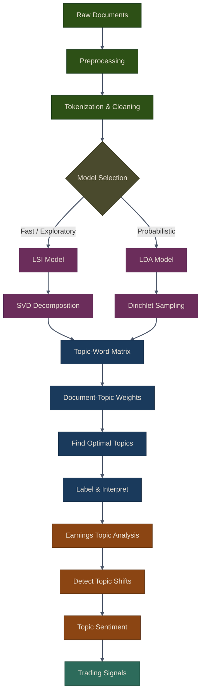

# Topic Modeling for Financial Text

Topic modeling is an unsupervised machine learning technique that discovers latent themes in large collections of documents. In algorithmic trading, topic modeling helps analyze earnings calls, financial news, and analyst reports to identify key themes and track how they evolve over time.

## Introduction to Topic Modeling

Topic modeling algorithms automatically identify topics (clusters of related words) in a corpus of documents. Unlike keyword searches or rule-based approaches, topic models discover patterns without prior knowledge of what topics exist.

**Key Applications in Trading:**
- Analyzing earnings call transcripts to identify strategic themes
- Tracking topic evolution across multiple quarters
- Comparing topics across different companies or sectors
- Detecting shifts in corporate strategy or market focus
- Sentiment analysis at the topic level

## Topic Modeling Workflow



## Model Selection: LSI vs LDA

| Feature | LSI | LDA |
|---------|-----|-----|
| **Method** | SVD on TF-IDF | Probabilistic generative |
| **Output** | Continuous weights | Probability distributions |
| **Speed** | Fast | Slower (iterative) |
| **Coherence** | No built-in metric | Coherence scoring |
| **Best for** | Exploratory analysis | Production systems |
| **Min documents** | ~20 | ~100 |

{: .note }
> **LSI** is ideal for quick exploratory analysis, while **LDA** excels in production systems where interpretable probability distributions and coherence metrics matter.

## Chapter Contents

This chapter covers two main areas:

1. **[LSI & LDA](01-lsi-lda.html)** -- Core topic modeling algorithms, finding optimal topics, visualization techniques, and interactive exploration with pyLDAvis.

2. **[Earnings Call Topic Analysis](02-earnings-topic-analysis.html)** -- The `EarningsTopicAnalyzer` for specialized earnings call analysis, topic shift detection, topic-level sentiment, and a complete trading workflow.

## Performance Considerations

### Parallel Processing with LDA

Gensim's LdaMulticore uses multiple CPU cores:

```python
# Automatically uses multiple cores
model = LDAModel(use_gensim=True)
model.fit(documents, n_topics=10, passes=15)
```

### Caching Results

Cache fitted models to avoid retraining:

```python
import pickle

# Save model
with open('earnings_lda_model.pkl', 'wb') as f:
    pickle.dump(analyzer, f)

# Load model
with open('earnings_lda_model.pkl', 'rb') as f:
    analyzer = pickle.load(f)

# Use cached model
new_weights = analyzer.model.transform(new_documents)
```

### Batch Processing

Process large document sets efficiently:

```python
batch_size = 100

for i in range(0, len(all_transcripts), batch_size):
    batch = all_transcripts[i:i+batch_size]

    # Process batch
    weights = model.transform(batch)

    # Store or analyze results
    process_batch_results(weights)
```

{: .tip }
> **Notebook**: Run the examples interactively in [`nlp_trading.ipynb`](https://github.com/MichaelTien8901/puffin/blob/main/notebooks/nlp_trading.ipynb)

## Related Chapters

- [Part 13: NLP for Trading]({{ site.baseurl }}/13-nlp-trading/) -- NLP fundamentals provide the tokenization and vectorization foundation that topic models build upon
- [Part 15: Word Embeddings]({{ site.baseurl }}/15-word-embeddings/) -- Word embeddings offer an alternative dense representation compared to topic model bag-of-words features
- [Part 3: Alternative Data]({{ site.baseurl }}/03-alternative-data/) -- Earnings call transcripts and other alternative data sources serve as primary input for topic analysis

## Source Code

Browse the implementation: [`puffin/nlp/`](https://github.com/MichaelTien8901/puffin/tree/main/puffin/nlp)

## Summary

Key takeaways:

- LSI and LDA discover latent topics without supervision
- Topic models reveal strategic themes in earnings calls
- Track topic evolution to detect strategic shifts
- Combine topics with sentiment for richer signals
- Use visualization to interpret and validate topics
- Consider preprocessing, topic count, and model choice carefully

Topic modeling transforms unstructured text into structured signals for algorithmic trading strategies.

## Next Steps

Topic modeling provides powerful insights into financial text. In the next chapters, we'll explore:

- Word embeddings for semantic similarity
- Deep learning approaches to NLP
- Combining topics with price data
- Real-time topic tracking systems
