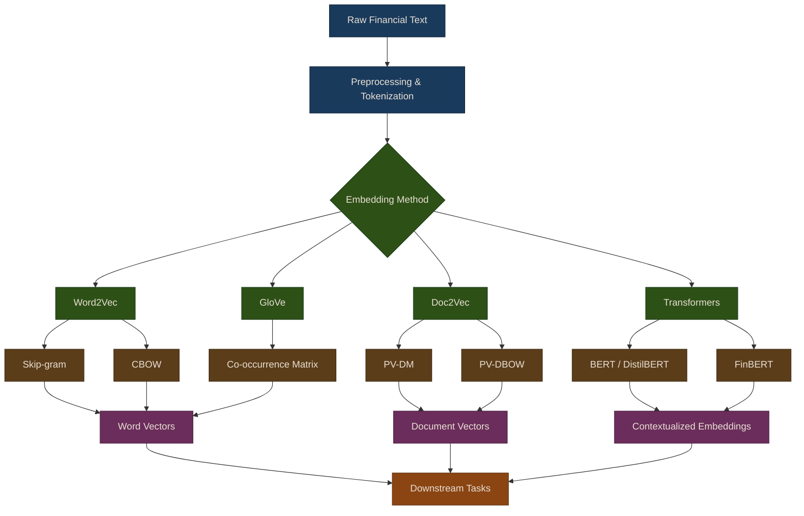

# Word Embeddings

Word embeddings are dense vector representations of words that capture semantic relationships and contextual meaning. Unlike traditional one-hot encodings, embeddings place semantically similar words close together in a continuous vector space, making them powerful tools for financial text analysis.

## Introduction to Word Embeddings

Word embeddings map words from a discrete vocabulary to continuous vectors in a high-dimensional space. Words with similar meanings or contexts have similar vector representations, enabling mathematical operations on language.

**Key Properties:**
- **Semantic similarity**: Related words have similar vectors
- **Compositionality**: Vector arithmetic captures relationships (e.g., "king" - "man" + "woman" = "queen")
- **Dimensionality reduction**: From sparse one-hot vectors to dense representations
- **Transfer learning**: Pre-trained embeddings can be used across tasks

## Embedding Methods Pipeline

The following diagram illustrates the hierarchy of embedding methods covered in this chapter, from classical static embeddings through document-level representations to modern contextualized transformers.

## Chapter Overview

This chapter covers three families of embedding techniques, progressing from classical to modern approaches:

### [Word2Vec & GloVe](01-word2vec-glove)

Static word embedding methods that learn fixed vector representations for each word in the vocabulary. Word2Vec uses local context windows (Skip-gram and CBOW architectures), while GloVe leverages global co-occurrence statistics. These methods form the foundation for understanding how language can be represented numerically.

{: .note }
> Word2Vec and GloVe produce a single vector per word regardless of context. The word "bank" gets the same vector whether it refers to a financial institution or a river bank.

### [Doc2Vec & SEC Filings](02-doc2vec-sec-filings)

Document-level embeddings that extend Word2Vec to represent entire documents as vectors. Doc2Vec (Paragraph Vectors) learns direct document representations via PV-DM and PV-DBOW architectures. This section also covers SEC filing analysis using the `SECFilingAnalyzer` class, including filing comparison and language change detection over time.

### [Transformer Embeddings](03-transformer-embeddings)

Contextualized embeddings from transformer models like BERT and FinBERT. Unlike static embeddings, transformers produce different representations for the same word depending on its surrounding context. This section covers semantic search, financial document clustering, and practical applications including news similarity detection, topic-based portfolio selection, and earnings call sentiment tracking.

## Summary

Word embeddings provide powerful representations for financial text analysis:

- **Word2Vec**: Learn embeddings from local context (Skip-gram, CBOW)
- **GloVe**: Global co-occurrence statistics
- **Doc2Vec**: Direct document embeddings
- **BERT/FinBERT**: Contextualized embeddings for state-of-the-art performance

Applications include:
- SEC filing analysis and change detection
- News similarity and deduplication
- Theme-based portfolio selection
- Sentiment tracking across documents

## Related Chapters

- [Part 13: NLP for Trading]({{ site.baseurl }}/13-nlp-trading/) -- NLP fundamentals cover the tokenization and preprocessing pipeline that feeds into embedding models
- [Part 14: Topic Modeling]({{ site.baseurl }}/14-topic-modeling/) -- Topic modeling provides an alternative unsupervised approach to capturing document-level meaning
- [Part 22: AI-Assisted Trading]({{ site.baseurl }}/22-ai-assisted-trading/) -- AI-assisted trading uses transformer embeddings and LLMs for advanced sentiment and signal generation
- [Part 16: Deep Learning]({{ site.baseurl }}/16-deep-learning/) -- Deep learning architectures underpin modern embedding methods like BERT and FinBERT

## Source Code

Browse the implementation: [`puffin/nlp/`](https://github.com/MichaelTien8901/puffin/tree/main/puffin/nlp)

## Further Reading

- [Mikolov et al. (2013). "Efficient Estimation of Word Representations in Vector Space"](https://arxiv.org/abs/1301.3781)
- [Pennington et al. (2014). "GloVe: Global Vectors for Word Representation"](https://aclanthology.org/D14-1162/)
- Le and Mikolov (2014). "Distributed Representations of Sentences and Documents"
- [Devlin et al. (2018). "BERT: Pre-training of Deep Bidirectional Transformers"](https://arxiv.org/abs/1810.04805)
- [Araci (2019). "FinBERT: Financial Sentiment Analysis with Pre-trained Language Models"](https://arxiv.org/abs/1908.10063)
