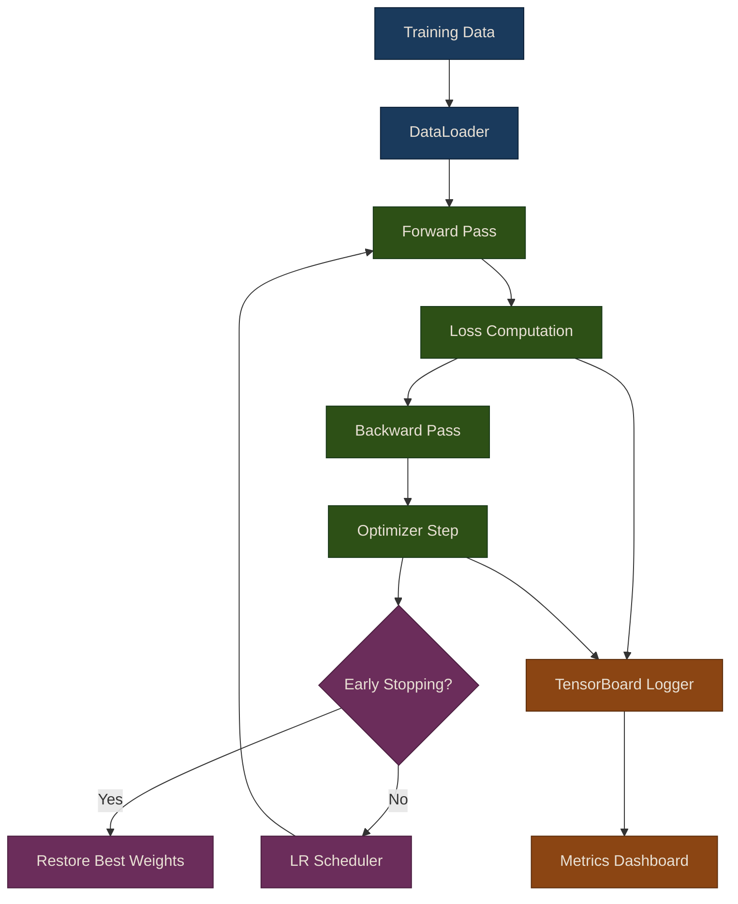

# Training Utilities

Training deep learning models for trading requires careful attention to regularization, learning rate management, and early stopping. Financial data is noisy and non-stationary, making these techniques even more critical than in standard deep learning applications. The `puffin.deep.training` module provides a comprehensive toolkit for managing the training process.

## Training Loop Architecture



## Early Stopping

Early stopping prevents overfitting by monitoring validation loss and stopping when it stops improving. This is one of the most important regularization techniques for financial models, where overfitting is a constant risk.

```python
from puffin.deep.training import EarlyStopping, training_loop, create_dataloaders
from puffin.deep import FeedforwardNet
import torch
import torch.nn as nn

# Create model and data loaders
model = FeedforwardNet(input_dim=50, hidden_dims=[64, 32], output_dim=1)
train_loader, val_loader = create_dataloaders(X, y, batch_size=64, val_split=0.2)

# Setup training
optimizer = torch.optim.Adam(model.parameters(), lr=0.001)
criterion = nn.MSELoss()

# Create early stopping callback
early_stop = EarlyStopping(
    patience=10,              # Stop after 10 epochs without improvement
    min_delta=0.0001,         # Minimum change to qualify as improvement
    restore_best_weights=True # Restore weights from best epoch
)

# Training loop with early stopping
def early_stop_callback(epoch, train_loss, val_loss, model):
    return early_stop(val_loss, model)

history = training_loop(
    model, train_loader, val_loader,
    epochs=200,
    optimizer=optimizer,
    criterion=criterion,
    callbacks=[early_stop_callback]
)
```

{: .note }
> The `restore_best_weights=True` parameter is important. Without it, training stops at the epoch where patience runs out, which may have worse performance than the best epoch. With it, the model reverts to the weights from the epoch with the lowest validation loss.

### How Early Stopping Works

The `EarlyStopping` class tracks validation loss across epochs:

1. **Best loss tracking**: Records the lowest validation loss seen so far
2. **Patience counter**: Increments when validation loss does not improve by at least `min_delta`
3. **Weight snapshot**: Saves model weights whenever a new best loss is achieved
4. **Termination**: Returns `True` (stop training) when the patience counter exceeds the threshold
5. **Restoration**: Loads the saved best weights back into the model

{: .tip }
> For financial models, a patience of 10-20 epochs is typical. Too low and you risk stopping before the model has converged; too high and you waste compute on epochs that will not improve the result.

## Learning Rate Scheduling

Learning rate schedules help training converge better by adjusting the learning rate during training. The `LRScheduler` class supports several strategies:

### Step Schedule

Reduces the learning rate by a multiplicative factor every N epochs:

```python
from puffin.deep.training import LRScheduler

# Step schedule: reduce LR every N epochs
scheduler = LRScheduler(
    optimizer,
    schedule_type='step',
    step_size=30,     # Reduce every 30 epochs
    gamma=0.1         # Multiply by 0.1
)
```

### Cosine Annealing

Smoothly decays the learning rate following a cosine curve:

```python
# Cosine annealing: smooth decay
scheduler = LRScheduler(
    optimizer,
    schedule_type='cosine',
    T_max=100,        # Total epochs
    eta_min=0.00001   # Minimum LR
)
```

### Warmup + Cosine

Starts with a linear warmup phase, then applies cosine annealing. This helps stabilize early training when gradients may be noisy:

```python
# Warmup + cosine: start slow, then decay
scheduler = LRScheduler(
    optimizer,
    schedule_type='warmup_cosine',
    warmup_epochs=10,  # Linear warmup for 10 epochs
    T_max=100,
    eta_min=0.00001
)
```

### Using the Scheduler in Training

```python
# Use in training loop
for epoch in range(100):
    # ... training code ...
    scheduler.step()
    current_lr = scheduler.get_last_lr()
    print(f"Epoch {epoch}, LR: {current_lr}")
```

{: .warning }
> Always call `scheduler.step()` after `optimizer.step()`. Calling it before the optimizer update can cause the first epoch to use an incorrect learning rate and produce unexpected training behavior.

## Dropout

Dropout randomly deactivates neurons during training, forcing the network to learn robust features rather than relying on any single neuron. This is a form of implicit ensemble learning.

```python
from puffin.deep import TradingFFN

# Dropout is included in model architecture
model = TradingFFN(
    input_dim=50,
    hidden_dims=[64, 32],
    output_dim=1,
    dropout=0.3  # 30% of neurons dropped during training
)
```

### Dropout Rate Guidelines for Financial Data

| Dropout Rate | Effect | When to Use |
|-------------|--------|-------------|
| 0.1 - 0.2 | Mild regularization | Large datasets, simple models |
| 0.3 - 0.4 | Moderate regularization | Most trading applications |
| 0.4 - 0.5 | Strong regularization | Small datasets, complex models |
| > 0.6 | Risk of underfitting | Rarely recommended |

{: .note }
> Dropout is automatically disabled during inference (when calling `model.predict()` or `model.eval()`). The outputs are scaled accordingly so that the expected value remains the same as during training.

## Batch Normalization

Batch normalization standardizes activations between layers, improving training stability and allowing higher learning rates:

```python
# Batch norm is automatically included in the FeedforwardNet architecture.
# For each hidden layer, the sequence is:
#   Linear -> BatchNorm1d -> Activation -> Dropout

# This means each layer's output is normalized to have mean=0, std=1
# before the activation function is applied.
```

Benefits of batch normalization:
- **Allows higher learning rates**: Normalized activations reduce sensitivity to LR choice
- **Reduces sensitivity to initialization**: Less dependent on weight initialization strategy
- **Acts as mild regularization**: The noise from mini-batch statistics provides a regularizing effect
- **Speeds up convergence**: Models typically train in fewer epochs

{: .tip }
> When using batch normalization with dropout, place dropout after batch norm. The `FeedforwardNet` class already follows this ordering: `Linear -> BatchNorm1d -> Activation -> Dropout`.

## Custom Callbacks

The `training_loop` function accepts a list of callback functions for advanced training control. Each callback receives the current epoch, training loss, validation loss, and the model, and returns a boolean indicating whether to stop training.

```python
from puffin.deep.training import training_loop, create_dataloaders
from puffin.deep.logging import TrainingLogger, MetricsTracker
from puffin.deep import FeedforwardNet
import torch
import torch.nn as nn

# Setup
model = FeedforwardNet(input_dim=50, hidden_dims=[64, 32], output_dim=1)
train_loader, val_loader = create_dataloaders(X_train, y_train, batch_size=64)
optimizer = torch.optim.Adam(model.parameters(), lr=0.001)
criterion = nn.MSELoss()

# Create logger and metrics tracker
logger = TrainingLogger(experiment_name='custom_training')
tracker = MetricsTracker()

# Custom callback: log to TensorBoard and track best model
best_val_loss = float('inf')

def logging_callback(epoch, train_loss, val_loss, model):
    global best_val_loss

    # Log to TensorBoard
    logger.log_scalars(
        epoch,
        train_loss=train_loss,
        val_loss=val_loss
    )

    # Track metrics
    tracker.update(train_loss=train_loss, val_loss=val_loss)

    # Save best model
    if val_loss < best_val_loss:
        best_val_loss = val_loss
        torch.save(model.state_dict(), 'best_model.pt')
        print(f"New best model saved at epoch {epoch}")

    return False  # Don't stop training

# Train with custom callback
history = training_loop(
    model, train_loader, val_loader,
    epochs=100,
    optimizer=optimizer,
    criterion=criterion,
    callbacks=[logging_callback]
)

logger.close()
```

{: .note }
> You can combine multiple callbacks. For example, use an early stopping callback alongside a logging callback. The training loop stops if any callback returns `True`.

## Reproducibility with `set_seed`

For reproducible experiments, the `set_seed` utility configures all random number generators:

```python
from puffin.deep.training import set_seed

# Set seed for PyTorch, NumPy, and Python random
set_seed(42)
```

This sets seeds for:
- `torch.manual_seed` (CPU operations)
- `torch.cuda.manual_seed_all` (GPU operations)
- `numpy.random.seed`
- `random.seed`
- CUDA deterministic mode (`torch.backends.cudnn.deterministic`)

{: .warning }
> Full reproducibility on GPU is not always guaranteed due to non-deterministic CUDA algorithms. Setting `torch.backends.cudnn.deterministic = True` helps but may reduce performance. For critical experiments, consider running on CPU.

## Best Practices for Financial Deep Learning

### 1. Data Preprocessing
- Always standardize/normalize features
- Handle missing data carefully (forward fill vs. drop)
- Use time-series aware train/test splits
- Be cautious of look-ahead bias

### 2. Architecture Design
- Start simple (2-3 layers) before going deep
- Use dropout (0.3-0.5) to prevent overfitting
- Batch normalization for stability
- ReLU or Leaky ReLU for hidden layers

### 3. Training Strategy
- Use early stopping (patience 10-20 epochs)
- Learning rate scheduling (cosine or step)
- Monitor both train and validation loss
- Save checkpoints regularly

### 4. Regularization
- L2 weight decay in optimizer
- Dropout in hidden layers
- Early stopping
- Data augmentation (if applicable)

### 5. Evaluation
- Use walk-forward testing
- Check for overfitting (train vs. val loss)
- Evaluate on out-of-sample data
- Consider transaction costs in backtesting

## Source Code

- Training utilities: [`puffin/deep/training.py`](https://github.com/MichaelTien8901/puffin/tree/main/puffin/deep/training.py)
- Logging and metrics: [`puffin/deep/logging.py`](https://github.com/MichaelTien8901/puffin/tree/main/puffin/deep/logging.py)
