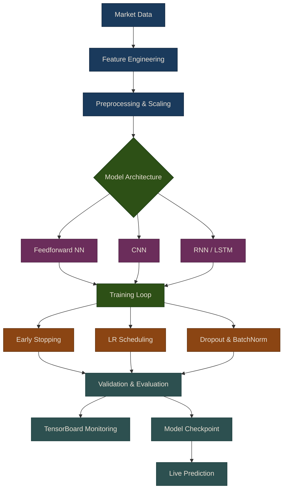

# Deep Learning Fundamentals for Trading

## Overview

This chapter introduces deep learning for algorithmic trading, covering feedforward neural networks, training techniques, and practical implementation using both PyTorch and TensorFlow. Deep learning models can capture complex non-linear relationships in market data that traditional ML models might miss.

## Why Deep Learning for Trading?

Deep learning offers several advantages for trading applications:

- **Non-linear Pattern Recognition**: Captures complex relationships between features
- **Feature Learning**: Automatically learns relevant representations from raw data
- **Time Series Modeling**: RNNs and LSTMs excel at sequential data
- **Multi-modal Data**: Can combine price data, news, and sentiment
- **Scalability**: Handles high-dimensional feature spaces effectively

However, deep learning also has challenges:
- Requires more data than traditional ML
- Prone to overfitting on financial data
- Computationally expensive
- Less interpretable than linear models

## Deep Learning Pipeline

The following diagram shows the end-to-end deep learning pipeline for trading, from raw data through model training and deployment.

## Chapter Overview

This chapter covers the foundations of deep learning for trading, progressing from basic architectures through training utilities to monitoring tools:

### [Feedforward Neural Networks](01-feedforward-nns)

The building blocks of deep learning. Covers the neuron model, activation functions, and multi-layer perceptron architectures for return prediction. Includes both PyTorch and TensorFlow implementations, along with a complete example pipeline for predicting stock returns.

{: .note }
> Feedforward networks are the simplest neural network architecture and serve as the foundation for all more advanced models. Start here before exploring CNNs, RNNs, or other architectures.

### [Training Utilities](02-training-utilities)

Essential training techniques that make the difference between a model that works and one that overfits. Covers early stopping, learning rate scheduling, dropout, batch normalization, custom callbacks, and best practices specific to financial data.

{: .tip }
> Financial data is notoriously noisy. Proper regularization and training discipline are more important in trading than in most other deep learning domains.

### [TensorBoard Integration](03-tensorboard)

Visual monitoring of training runs using TensorBoard. Covers the `TrainingLogger` class, logging hyperparameters, model graphs, scalar metrics, weight distributions, and gradient norms. Includes guidance on which metrics to track and how to interpret them.

## Common Pitfalls

### Overfitting
**Problem**: Model memorizes training data, fails on new data.

**Solutions**:
- More dropout
- Early stopping
- Simpler architecture
- More training data
- Regularization

### Underfitting
**Problem**: Model can't learn the patterns.

**Solutions**:
- Deeper or wider network
- Lower dropout
- More training epochs
- Better features
- Lower learning rate

### Vanishing/Exploding Gradients
**Problem**: Gradients become too small or too large.

**Solutions**:
- Use batch normalization
- Gradient clipping
- Better weight initialization
- ReLU activation
- Skip connections (ResNets)

### Predicting Noise
**Problem**: Financial returns are noisy; model may learn noise.

**Solutions**:
- Focus on feature quality over model complexity
- Use ensemble methods
- Predict direction rather than exact returns
- Incorporate market regime detection

## Summary

Deep learning for trading requires:
1. **Solid foundations**: Understanding neural networks, activation functions, and backpropagation
2. **Framework choice**: PyTorch for research/flexibility, TensorFlow for production
3. **Training techniques**: Early stopping, LR scheduling, dropout, batch norm
4. **Monitoring**: TensorBoard for visualizing training progress
5. **Best practices**: Time-series aware splits, regularization, walk-forward testing

The `puffin.deep` module provides all these tools with both PyTorch and TensorFlow implementations, making it easy to experiment with deep learning for algorithmic trading.

{: .tip }
> **Notebook**: Run the examples interactively in [`deep_learning.ipynb`](https://github.com/MichaelTien8901/puffin/blob/main/notebooks/deep_learning.ipynb)

## Related Chapters

- [Part 17: CNNs for Trading]({{ site.baseurl }}/17-cnns-for-trading/) -- Convolutional networks extend deep learning fundamentals to spatial and temporal pattern detection
- [Part 18: RNNs for Trading]({{ site.baseurl }}/18-rnns-for-trading/) -- Recurrent networks extend deep learning fundamentals to sequential time series modeling
- [Part 19: Autoencoders]({{ site.baseurl }}/19-autoencoders/) -- Unsupervised deep learning for feature extraction and anomaly detection
- [Part 21: Deep RL]({{ site.baseurl }}/21-deep-rl/) -- Reinforcement learning agents built on deep network function approximation
- [Part 8: Linear Models]({{ site.baseurl }}/08-linear-models/) -- Linear models serve as interpretable baselines to benchmark deep learning improvements

## Source Code

Browse the implementation: [`puffin/deep/`](https://github.com/MichaelTien8901/puffin/tree/main/puffin/deep)

## Next Steps

- **CNNs for Trading**: Apply convolutional networks to time series
- **RNNs and LSTMs**: Model sequential dependencies in market data
- **Autoencoders**: Dimensionality reduction and anomaly detection
- **GANs**: Generate synthetic market data for training

## References

- Goodfellow et al. (2016): [*Deep Learning*](https://www.deeplearningbook.org/)
- [Paszke et al. (2019): *PyTorch: An Imperative Style, High-Performance Deep Learning Library*](https://arxiv.org/abs/1912.01703)
- Abadi et al. (2016): *TensorFlow: Large-Scale Machine Learning on Heterogeneous Systems*
- Dixon et al. (2020): *Machine Learning in Finance*
