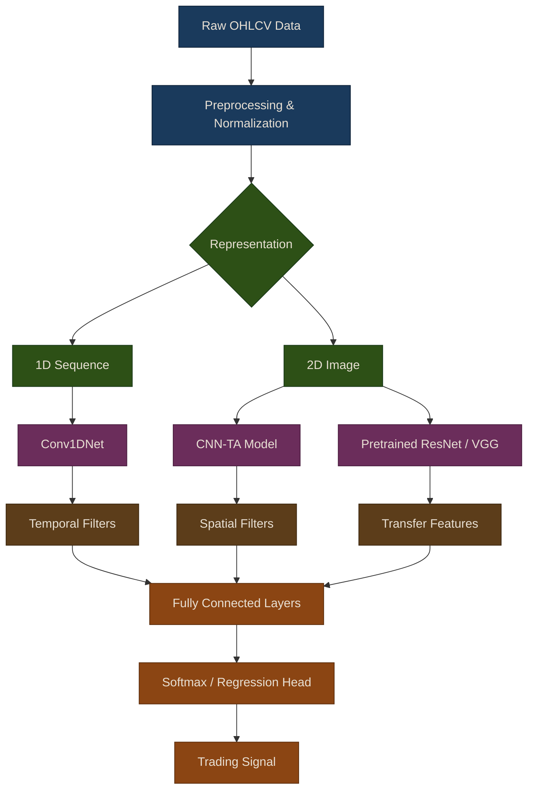

# CNNs for Trading

Convolutional Neural Networks (CNNs) are powerful tools originally designed for computer vision tasks. However, their ability to detect spatial and temporal patterns makes them surprisingly effective for financial time series analysis. In this chapter, we explore how CNNs can be applied to algorithmic trading through two complementary approaches: direct 1D convolution over time series, and 2D image representations enhanced by transfer learning.

## Why CNNs for Trading?

CNNs offer several properties that translate well from image recognition to financial pattern detection:

- **Pattern recognition**: Detecting recurring chart patterns and technical formations
- **Feature extraction**: Automatically learning relevant features from raw data
- **Translation invariance**: Recognizing patterns regardless of when they occur in a time series
- **Hierarchical learning**: Building complex representations from simple local patterns

{: .note }
> CNNs complement rather than replace traditional quantitative analysis. They are most effective when combined with domain-specific feature engineering and rigorous out-of-sample validation.

## CNN Architecture Pipeline

The following diagram traces how raw financial data flows through the CNN-based trading system, from data ingestion through model selection to trade signal generation.

## Chapter Overview

This chapter is organized into two sub-chapters that progressively build from simple temporal convolutions to sophisticated image-based approaches with transfer learning.

### [1D CNNs for Time Series](01-1d-cnn-time-series)

1D convolutional networks apply sliding filters along the time dimension to detect temporal patterns directly from sequential data. The `Conv1DNet` and `TradingCNN` classes provide a streamlined API for autoregressive price and volatility forecasting. This section covers architecture design, sequence preparation, training workflows, and practical best practices for avoiding overfitting in financial time series.

{: .tip }
> 1D CNNs are the fastest CNN approach to prototype and train. Start here if you are new to applying convolutional models to market data.

### [CNN-TA and Transfer Learning](02-cnn-ta-transfer-learning)

The CNN-TA approach converts multi-indicator time series into 2D heatmap images, enabling standard computer vision architectures to detect cross-indicator spatial patterns. Transfer learning then leverages pretrained models (ResNet, VGG, MobileNet) trained on millions of images and fine-tunes them for financial classification. This section includes a complete trading strategy example with signal generation and performance evaluation.

{: .warning }
> Transfer learning with large pretrained models (ResNet-50, VGG-19) can be memory-intensive. Use lighter models like MobileNetV2 or ResNet-18 when GPU resources are limited.

## Comparison of Approaches

| Approach | Pros | Cons | Best For |
|----------|------|------|----------|
| **1D CNN** | Fast, simple, efficient | Limited feature interaction | Single asset forecasting |
| **CNN-TA** | Rich representation, interpretable | More complex, needs OHLCV | Multi-indicator strategies |
| **Transfer** | Works with small data, powerful | Slow, needs GPU | Limited training data |

## Key Takeaways

1. **CNNs are versatile**: Can be applied to time series in multiple ways
2. **Image representation works**: Treating data as images is surprisingly effective
3. **Transfer learning helps**: Pretrained models provide strong baselines even with limited financial data
4. **Validation is critical**: Always use out-of-sample testing with time-series aware splits
5. **Combine with traditional analysis**: CNNs complement fundamental and technical analysis

{: .tip }
> **Notebook**: Run the examples interactively in [`deep_learning.ipynb`](https://github.com/MichaelTien8901/puffin/blob/main/notebooks/deep_learning.ipynb)

## Related Chapters

- [Part 16: Deep Learning Fundamentals]({{ site.baseurl }}/16-deep-learning/) -- Foundational neural network concepts, training techniques, and monitoring that underpin CNN architectures
- [Part 18: RNNs for Trading]({{ site.baseurl }}/18-rnns-for-trading/) -- Recurrent networks offer an alternative architecture for sequential market data
- [Part 4: Alpha Factors]({{ site.baseurl }}/04-alpha-factors/) -- Alpha factors and technical indicators serve as input features for CNN-based models

## Source Code

Browse the implementation: [`puffin/deep/`](https://github.com/MichaelTien8901/puffin/tree/main/puffin/deep)

## References

- [LeCun et al. (1998): "Gradient-Based Learning Applied to Document Recognition"](https://doi.org/10.1109/5.726791)
- [Sezer et al. (2020): "Financial Time Series Forecasting with Deep Learning: A Systematic Literature Review"](https://doi.org/10.1016/j.asoc.2020.106181)
- Jiang et al. (2017): "Deep Neural Networks for Stock Market Prediction: A Survey"
