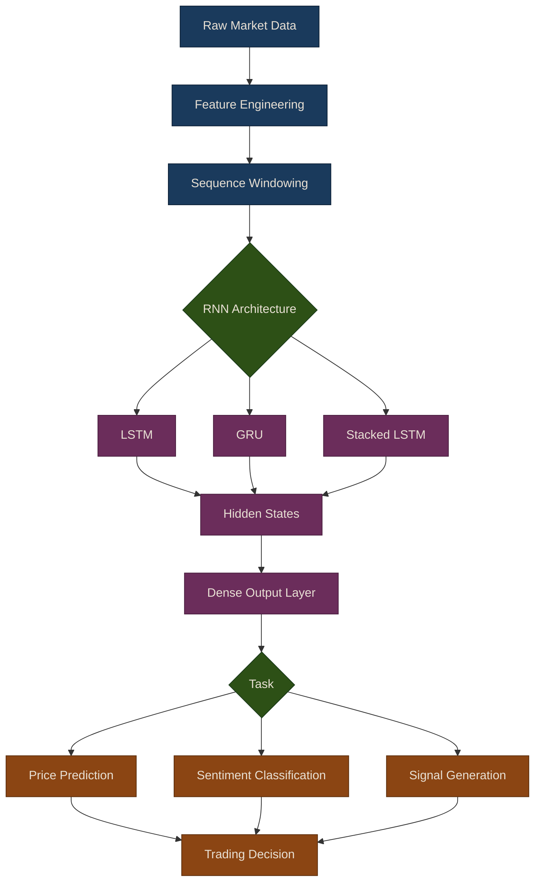

# RNNs for Trading

Recurrent Neural Networks (RNNs) are specifically designed to handle sequential data, making them particularly well-suited for time series prediction in algorithmic trading. Unlike feedforward networks that treat each input independently, RNNs maintain an internal hidden state that captures information about previous time steps -- a form of memory that is essential for modeling financial time series.

## Why RNNs for Time Series?

Traditional feedforward neural networks have no concept of temporal ordering. RNNs address this by processing one time step at a time while carrying forward a hidden state that encodes the history of the sequence.

**Key Characteristics:**
- **Sequential Processing**: Process one time step at a time while maintaining context
- **Parameter Sharing**: Same weights used across all time steps
- **Variable-Length Sequences**: Can handle sequences of different lengths
- **Memory**: Hidden state acts as memory of past observations

{: .note }
> RNNs are not the only option for sequence modeling. Transformers (covered in later chapters) have largely overtaken RNNs on NLP tasks, but LSTMs and GRUs remain competitive for shorter financial time series where the inductive bias of recurrence is beneficial.

## The Vanishing Gradient Problem

One of the main challenges with basic (vanilla) RNNs is the **vanishing gradient problem**. During backpropagation through time (BPTT), gradients can become exponentially small as they propagate backward through many time steps, making it difficult to learn long-range dependencies.

```python
import numpy as np

# Simulate gradient flow through time
def gradient_flow(num_steps, weight=0.5):
    """Show how gradients vanish over time steps."""
    gradient = 1.0
    gradients = [gradient]

    for t in range(num_steps):
        gradient *= weight  # Gradient gets multiplied at each step
        gradients.append(gradient)

    return gradients

# After 50 time steps with weight < 1
gradients = gradient_flow(50, weight=0.5)
print(f"Initial gradient: {gradients[0]}")
print(f"Gradient after 50 steps: {gradients[-1]:.2e}")
# Output: Gradient after 50 steps: 8.88e-16 (essentially zero!)
```

This motivates the gated architectures -- LSTM and GRU -- covered in the sub-pages below.

## RNN Architecture Pipeline

The following diagram shows the progression from raw market data through RNN-based model architectures to trading decisions.



## Chapter Overview

This chapter covers three core topics for applying recurrent networks to algorithmic trading:

### [LSTM Fundamentals](01-lstm-fundamentals)

Long Short-Term Memory networks solve the vanishing gradient problem through a gated cell architecture with forget, input, and output gates. This section covers the mathematical formulation, a from-scratch implementation using PyTorch, univariate price prediction with the `TradingLSTM` wrapper, and multivariate forecasting with technical indicators via `MultivariateLSTM`.

### [Stacked LSTM & GRU](02-stacked-lstm-gru)

Stacking multiple recurrent layers builds hierarchical feature representations, where lower layers capture short-term patterns and upper layers capture longer-term structure. This section also introduces the GRU as a lighter alternative to LSTM, covers hyperparameter tuning, regularization techniques, and walk-forward evaluation with direction accuracy metrics.

### [Sentiment RNN](03-sentiment-rnn)

LSTMs with word embeddings are effective for classifying financial text sentiment. This section covers the `SentimentLSTM` and `SentimentClassifier` classes, pretrained GloVe embeddings, and integration of text-derived sentiment signals with price-based features for combined prediction.

## Summary

RNNs and their gated variants provide a natural framework for sequential financial data:

- **LSTM**: Three-gate architecture for capturing long-term dependencies in price and volume series
- **GRU**: Simpler two-gate alternative with fewer parameters and faster training
- **Stacked architectures**: Hierarchical feature learning through multiple recurrent layers
- **Sentiment analysis**: LSTM with word embeddings for classifying financial text
- **Multivariate prediction**: Combining price, volume, and indicator features in a single model

{: .warning }
> RNN-based price prediction is not a guaranteed path to profits. Markets are noisy and non-stationary. Always use walk-forward validation, test on out-of-sample data, and combine model predictions with proper risk management before deploying to live trading.

## Related Chapters

- [Part 16: Deep Learning Fundamentals]({{ site.baseurl }}/16-deep-learning/) -- Foundational neural network concepts, training utilities, and TensorBoard monitoring that underpin RNN architectures
- [Part 17: CNNs for Trading]({{ site.baseurl }}/17-cnns-for-trading/) -- Convolutional networks provide an alternative deep learning architecture for time series
- [Part 9: Time Series Models]({{ site.baseurl }}/09-time-series-models/) -- Classical time series methods (ARIMA, GARCH) complement RNNs for sequential market data
- [Part 13: NLP for Trading]({{ site.baseurl }}/13-nlp-trading/) -- NLP preprocessing and sentiment pipelines feed into the Sentiment RNN covered in this chapter

## Source Code

Browse the implementation: [`puffin/deep/rnn.py`](https://github.com/MichaelTien8901/puffin/tree/main/puffin/deep/rnn.py) | [`puffin/deep/sentiment_rnn.py`](https://github.com/MichaelTien8901/puffin/tree/main/puffin/deep/sentiment_rnn.py)

## Further Reading

- [Hochreiter & Schmidhuber (1997). "Long Short-Term Memory"](https://doi.org/10.1162/neco.1997.9.8.1735)
- [Cho et al. (2014). "Learning Phrase Representations using RNN Encoder-Decoder"](https://arxiv.org/abs/1406.1078)
- [Colah's Blog: "Understanding LSTM Networks"](https://colah.github.io/posts/2015-08-Understanding-LSTMs/)
- Sequence Models course by deeplearning.ai
