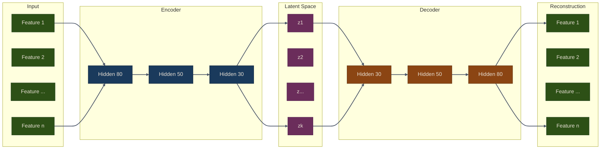

# Autoencoders for Trading

## Overview

Autoencoders are neural networks designed to learn efficient representations of data through unsupervised learning. In trading, they compress high-dimensional market data into meaningful latent features, detect anomalies in market behavior, and generate synthetic scenarios for stress testing.

Unlike supervised models that map inputs to labels, autoencoders learn by reconstructing their own input through a bottleneck layer. This forces the network to discover the most salient structure in the data -- structure that can then drive feature engineering, risk modeling, and portfolio construction.

{: .note }
> Chapter 20 of *Machine Learning for Algorithmic Trading* covers autoencoders for conditional risk factors,
> variational autoencoders, and asset pricing applications. This part implements those techniques
> in the `puffin.deep.autoencoder` module.

## Autoencoder Architecture

The core idea is simple: compress, then reconstruct. The quality of the reconstruction tells us how well the bottleneck captures the essential information.



The bottleneck (latent space) has fewer dimensions than the input, forcing the network to learn a compressed representation that retains only the most important information.

## Autoencoder Variants for Trading

| Variant | Key Idea | Trading Application |
|---------|----------|-------------------|
| **Standard AE** | Minimize reconstruction error | Dimensionality reduction, feature extraction |
| **Denoising AE** | Corrupt input, reconstruct clean | Robust features from noisy market data |
| **Variational AE** | Learn latent distribution, sample | Synthetic data generation, anomaly detection |
| **Conditional AE** | Condition on external factors | Regime-dependent asset pricing |

{: .tip }
> Start with a standard autoencoder to verify your data pipeline works correctly.
> Move to denoising or variational variants only after validating the basic approach.

## Puffin Module Structure

All autoencoder implementations live in a single module with a shared trainer:

```python
from puffin.deep.autoencoder import (
    Autoencoder,              # Standard feedforward AE
    DenoisingAutoencoder,     # Noise-injection AE
    VAE,                      # Variational AE
    ConditionalAutoencoder,   # Condition-aware AE
    AETrainer                 # Unified training loop
)
```

The `AETrainer` class handles training for all four variants, including automatic detection of VAE loss (reconstruction + KL divergence) versus standard MSE reconstruction loss.

## Key Advantages

- **Unsupervised**: No labels required -- learns structure from raw market data
- **Flexible compression**: Reduce hundreds of technical indicators to a handful of latent factors
- **Anomaly detection**: High reconstruction error signals unusual market conditions
- **Generative capability**: VAE can synthesize realistic market scenarios for stress testing

## What You Will Learn

1. [**Standard & Denoising Autoencoders**](01-standard-denoising.md) -- Dimensionality reduction, robust feature extraction, anomaly detection, and regime detection from latent representations
2. [**Variational Autoencoders**](02-variational-ae.md) -- Probabilistic latent spaces, the reparameterization trick, synthetic data generation, and the VAE loss function
3. [**Conditional Autoencoders for Asset Pricing**](03-conditional-ae.md) -- Regime-dependent modeling, macro-conditioned factor extraction, and a complete trading pipeline

{: .tip }
> **Notebook**: Run the examples interactively in [`deep_learning.ipynb`](https://github.com/MichaelTien8901/puffin/blob/main/notebooks/deep_learning.ipynb)

## Related Chapters

- [Part 16: Deep Learning Fundamentals]({{ site.baseurl }}/16-deep-learning/) -- Foundational neural network training techniques that autoencoders build upon
- [Part 12: Unsupervised Learning]({{ site.baseurl }}/12-unsupervised-learning/) -- PCA and clustering provide classical unsupervised counterparts to autoencoder-based dimensionality reduction
- [Part 20: Synthetic Data with GANs]({{ site.baseurl }}/20-synthetic-data-gans/) -- GANs extend the generative modeling ideas introduced by variational autoencoders
- [Part 5: Portfolio Optimization]({{ site.baseurl }}/05-portfolio-optimization/) -- Latent factors extracted by autoencoders can drive portfolio construction and risk modeling

## Source Code

Browse the implementation: [`puffin/deep/autoencoder.py`](https://github.com/MichaelTien8901/puffin/tree/main/puffin/deep/autoencoder.py)
