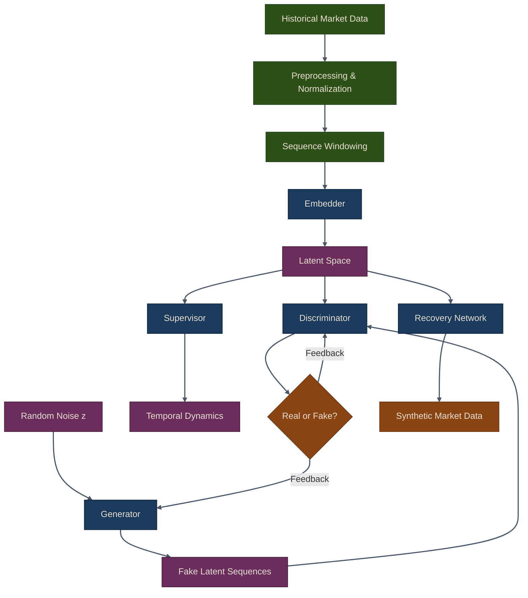

# Synthetic Data with GANs

## Overview

Generative Adversarial Networks (GANs) generate realistic synthetic data by training two neural networks in competition. In trading, GANs create synthetic market data for backtesting, data augmentation, and stress testing -- addressing the fundamental challenge that historical data is always finite while the space of possible market outcomes is vast.

{: .note }
> Chapter 21 of *Machine Learning for Algorithmic Trading* covers GANs for synthetic time-series
> data, including TimeGAN. This part implements those techniques in the `puffin.deep.gan` module.

## Why Synthetic Data for Trading?

Financial ML suffers from a chronic data shortage. Markets generate one day of data per trading day -- you cannot accelerate that. GANs offer a principled approach to creating additional realistic samples:

- **Data augmentation**: Generate additional training examples for rare events (crashes, flash crashes, extreme volatility)
- **Stress testing**: Test strategies under hypothetical scenarios not seen in the historical record
- **Privacy**: Share synthetic data without exposing proprietary positions or alpha signals
- **Research**: Experiment with different market dynamics to test strategy robustness

{: .warning }
> Synthetic data is only as good as its evaluation. Always validate generated samples against
> real data using the statistical tests covered in the evaluation sub-page.

## GAN Training Pipeline



## Chapter Contents

| Sub-page | Topics |
|---|---|
| [GAN Architecture Fundamentals](01-gan-architecture) | Generator, discriminator, adversarial training, data augmentation, training stability |
| [TimeGAN for Financial Data](02-timegan) | Temporal dependencies, embedder/recovery/supervisor architecture, scenario generation |
| [Synthetic Data Evaluation](03-synthetic-evaluation) | Distribution comparison, autocorrelation structure, PCA analysis, full evaluation pipeline |

## The Adversarial Game

At its core, a GAN is a two-player minimax game:

1. **Generator** G(z) maps random noise to fake data samples
2. **Discriminator** D(x) outputs the probability that x is real (not generated)
3. G tries to maximize D's error rate; D tries to minimize it
4. At equilibrium, G produces samples indistinguishable from real data

```python
from puffin.deep.gan import GAN

# The generator and discriminator train together
gan = GAN(latent_dim=10, data_dim=20)
history = gan.train(real_data, epochs=100, batch_size=64, lr=0.0002)

# At convergence: D(G(z)) ~ 0.5 (discriminator cannot tell real from fake)
```

{: .tip }
> Monitor both generator and discriminator loss during training. If the discriminator
> loss collapses to zero, the generator has likely suffered mode collapse.

## Common Pitfalls

1. **Mode collapse**: Generator produces limited variety of samples. Use diverse training data, adjust learning rates, or try Wasserstein GAN.

2. **Training instability**: Losses oscillate wildly. Lower learning rate, add gradient clipping, use spectral normalization.

3. **Poor quality samples**: Synthetic data doesn't match real data statistics. More training epochs, better architecture, more training data.

4. **Overfitting**: GAN memorizes training data instead of learning the distribution. Use more diverse training data, regularization, or early stopping.

## Best Practices

- Always normalize input data before training (StandardScaler)
- Use conservative learning rates (0.0001 to 0.0003)
- Balance discriminator and generator update frequency
- Validate synthetic data quality with statistical tests before use
- Check for mode collapse by visualizing sample diversity with PCA

## Exercises

1. Train a basic GAN on daily return data for 10 stocks. Compare the marginal distributions of real and synthetic returns using KS tests.

2. Use TimeGAN to generate 50 synthetic 30-day market scenarios. Are the autocorrelation structures preserved?

3. Augment a small training set (500 samples) with GAN-generated data and measure the impact on a RandomForest classifier's accuracy.

4. Generate stress-test scenarios by conditioning on high-volatility periods. How do your strategies perform?

5. Apply PCA to both real and synthetic data. Do they share the same principal component structure?

## Summary

- **Standard GAN**: Cross-sectional market data generation using adversarial training
- **TimeGAN**: Time series with temporal dependencies via embedder, supervisor, and recovery networks
- **Evaluation**: Statistical tests (KS test, autocorrelation, PCA) validate synthetic data quality

Key applications: data augmentation for rare events, stress testing and scenario analysis, privacy-preserving data sharing, and research experimentation.

## Related Chapters

- [Part 19: Autoencoders]({{ site.baseurl }}/19-autoencoders/) -- Variational autoencoders introduce generative latent-space modeling that GANs extend
- [Part 16: Deep Learning Fundamentals]({{ site.baseurl }}/16-deep-learning/) -- Foundational neural network training techniques used by both the generator and discriminator
- [Part 7: Backtesting]({{ site.baseurl }}/07-backtesting/) -- Synthetic data generated by GANs can augment backtesting with stress-test scenarios

## Source Code

Browse the implementation: [`puffin/deep/gan.py`](https://github.com/MichaelTien8901/puffin/tree/main/puffin/deep/gan.py)

## Next Steps

Part 21 explores **Deep Reinforcement Learning**: Q-learning, DQN, and trading agents that learn optimal policies through interaction with market environments.
