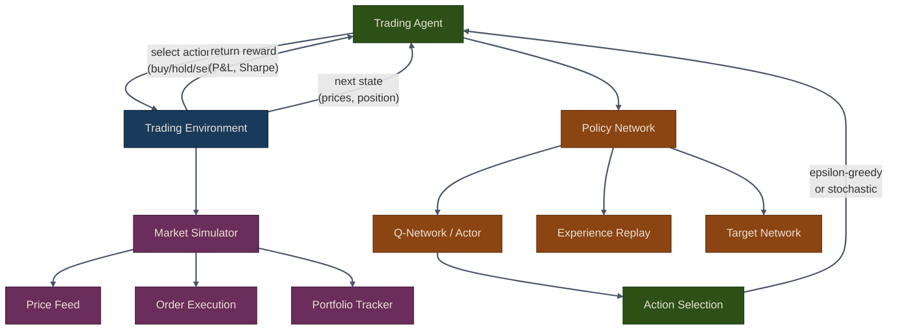

# Deep Reinforcement Learning for Trading

## Overview

Deep Reinforcement Learning (RL) offers a powerful framework for developing adaptive trading strategies that learn from market interactions. Unlike supervised learning, which requires labeled training data, RL agents learn by trial and error --- receiving rewards or penalties based on trading decisions and iteratively improving their policies.

In algorithmic trading, the RL framework maps naturally:

- **State**: Market features and portfolio status (prices, indicators, position, cash, P&L)
- **Action**: Trading decisions (buy, hold, sell, or continuous position sizing)
- **Reward**: Immediate feedback (profit/loss, risk-adjusted return, Sharpe ratio)
- **Policy**: Strategy mapping states to actions
- **Value Function**: Expected cumulative reward for state-action pairs

{: .note }
> Chapter 22 of *Machine Learning for Algorithmic Trading* covers Q-learning, DQN, DDQN,
> and OpenAI Gym trading agents. This part implements those techniques plus PPO using
> the `puffin.rl` module with Gymnasium and stable-baselines3.

## Agent-Environment Loop

The core RL loop describes how an agent interacts with a trading environment over time, observing market states, taking actions, and receiving rewards that guide learning.

## Chapter Contents

| Sub-page | Topics |
|---|---|
| [Q-Learning Fundamentals](01-q-learning) | Bellman equation, tabular Q-learning, state discretization, epsilon-greedy exploration, trading example |
| [DQN & Double DQN](02-dqn-ddqn) | Deep Q-Networks, experience replay, target networks, Double DQN, overestimation bias, agent comparison |
| [PPO & Trading Environment](03-ppo-trading-env) | Custom Gymnasium environment, reward functions, Proximal Policy Optimization, evaluation, best practices |

## Key Concepts

**Exploration vs Exploitation**: RL agents must balance exploring new actions (to discover better strategies) with exploiting known good actions (to maximize returns). Epsilon-greedy policies decay exploration over training.

**Temporal Difference Learning**: Rather than waiting for episode completion, TD methods update value estimates from partial trajectories. Q-learning is an off-policy TD method --- it learns from actions different from its current policy.

**Function Approximation**: Tabular Q-learning works for small state spaces but breaks down with continuous market data. Neural networks approximate Q-values, enabling DQN and policy gradient methods like PPO.

{: .warning }
> RL agents for trading are notoriously prone to overfitting. Always validate on held-out
> data, include realistic transaction costs, and be skeptical of in-sample performance.

## Common Pitfalls

1. **No transaction costs**: Agents learn to trade excessively if commissions are zero. Always include realistic costs.

2. **Reward hacking**: Simple P&L rewards encourage excessive risk. Use Sharpe or risk-adjusted rewards instead.

3. **Non-stationary environments**: Markets change over time. Retrain agents periodically and monitor for regime shifts.

4. **Look-ahead bias**: Ensure the environment only provides information available at decision time.

5. **Insufficient exploration**: Agents that converge too quickly may find local optima. Tune epsilon decay carefully.

## Summary

- **Q-Learning** provides the foundation for value-based RL with discrete states and actions
- **DQN/DDQN** scale to high-dimensional observations using neural network function approximation
- **PPO** handles continuous action spaces and offers stable policy gradient updates
- **Custom environments** enable realistic backtesting with transaction costs and position limits
- **Evaluation** requires out-of-sample testing with risk-adjusted metrics

{: .tip }
> **Notebook**: Run the examples interactively in [`deep_learning.ipynb`](https://github.com/MichaelTien8901/puffin/blob/main/notebooks/deep_learning.ipynb) (covers Parts 16–21, including RL)

## Related Chapters

- [Part 16: Deep Learning Fundamentals]({{ site.baseurl }}/16-deep-learning/) -- Neural network foundations used by DQN and PPO policy networks
- [Part 6: Trading Strategies]({{ site.baseurl }}/06-trading-strategies/) -- Classical trading strategies that RL agents can learn and potentially surpass
- [Part 7: Backtesting]({{ site.baseurl }}/07-backtesting/) -- The backtesting engine provides the simulation environment for RL agent training and evaluation
- [Part 22: AI-Assisted Trading]({{ site.baseurl }}/22-ai-assisted-trading/) -- Combines RL agents with LLM-based reasoning for next-generation trading systems

## Source Code

Browse the implementation: [`puffin/rl/`](https://github.com/MichaelTien8901/puffin/tree/main/puffin/rl)

## Next Steps

Part 22 covers **AI-Assisted Trading**: using LLMs for sentiment analysis, structured reasoning, and agentic portfolio management.
