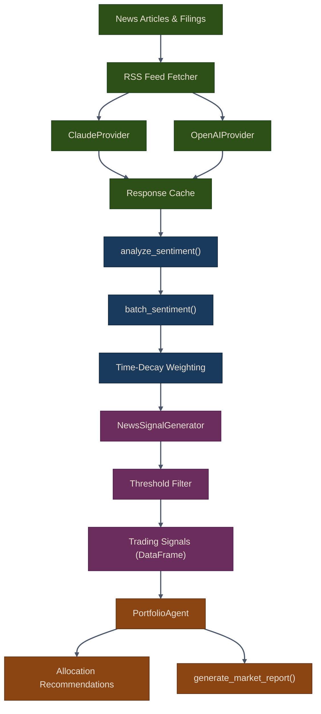

# Part 22: AI-Assisted Trading

Large Language Models (LLMs) like Claude and GPT-4 bring powerful new capabilities to algorithmic trading: analyzing sentiment in news articles, generating portfolio recommendations, and creating comprehensive market reports. In this chapter, you will learn how to integrate LLMs into your trading system using Puffin's `puffin.ai` module.

## Architecture

The AI-assisted trading pipeline follows a layered design. Raw financial text flows through LLM providers, gets scored by the sentiment engine, converts into tradable signals, and finally reaches the portfolio agent for allocation decisions.

## What You Will Build

By the end of this chapter you will have a working pipeline that:

- Connects to multiple LLM providers through a single abstract interface
- Extracts bullish/bearish sentiment scores from financial news with confidence levels
- Converts raw sentiment into filtered, time-weighted trading signals
- Delegates portfolio allocation to an AI agent that reasons over positions, market data, and signals
- Generates formatted market analysis reports on demand

## Module Overview

The `puffin.ai` package exposes the following components:

| Component | Module | Purpose |
|-----------|--------|---------|
| `LLMProvider` | `puffin.ai.llm_provider` | Abstract base class with caching |
| `ClaudeProvider` | `puffin.ai.providers` | Anthropic Claude integration |
| `OpenAIProvider` | `puffin.ai.providers` | OpenAI GPT integration |
| `analyze_sentiment` | `puffin.ai.sentiment` | Single-text sentiment extraction |
| `batch_sentiment` | `puffin.ai.sentiment` | Batch analysis with time decay |
| `NewsSignalGenerator` | `puffin.ai.signals` | Sentiment-to-signal conversion |
| `PortfolioAgent` | `puffin.ai.agent` | AI portfolio management |
| `generate_market_report` | `puffin.ai.reports` | Markdown report generation |
| `fetch_rss_news` | `puffin.ai.news` | RSS news article fetcher |

{: .note }
All LLM providers cache responses by default (keyed on provider, model, text, and prompt) to minimize API costs. You can tune the TTL with `cache_ttl`.

## Chapters

1. [LLM Providers](01-llm-providers) -- Abstract provider interface, Claude and OpenAI implementations, caching, fallback strategies, and async patterns
2. [Sentiment & Signals](02-sentiment-signals) -- Sentiment extraction, batch analysis with time decay, news-driven signal generation, and strategy integration
3. [AI Agent Portfolio Manager](03-ai-agent) -- Portfolio agent recommendations, audit trail, executing trades, market report generation, and the complete news-driven bot

## Prerequisites

Before starting this chapter, make sure you have:

- An Anthropic API key (`ANTHROPIC_API_KEY`) and/or OpenAI API key (`OPENAI_API_KEY`)
- Familiarity with the Strategy pattern from [Part 6: Trading Strategies](../06-trading-strategies/)
- A working data pipeline from [Part 2: Data Pipeline](../02-data-pipeline/)

{: .warning }
LLM API calls incur real costs. Start with short texts and use caching aggressively during development. Monitor your token usage before running batch analyses.

## Related Chapters

- [Part 15: Word Embeddings]({{ site.baseurl }}/15-word-embeddings/) -- Transformer and word2vec embeddings that power the NLP features LLM providers build on
- [Part 13: NLP & Trading]({{ site.baseurl }}/13-nlp-trading/) -- Tokenization and sentiment pipelines that feed into AI-assisted analysis
- [Part 23: Live Trading Execution]({{ site.baseurl }}/23-live-trading/) -- Routes AI-generated signals and agent recommendations to the broker for execution
- [Part 25: Monitoring & Analytics]({{ site.baseurl }}/25-monitoring-analytics/) -- Tracks performance of AI-driven trades and surfaces them in dashboards

## Source Code

Browse the full implementation: [`puffin/ai/`](https://github.com/MichaelTien8901/puffin/tree/main/puffin/ai)

## Next Steps

Start with [LLM Providers](01-llm-providers) to set up your first provider connection, then work through sentiment analysis and the portfolio agent.
