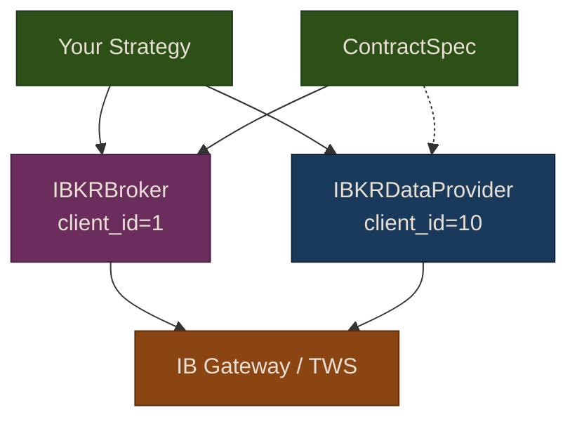

# IBKR Advanced Trading

## Overview

Interactive Brokers supports far more than US stocks. This chapter covers trading options, futures, and forex through Puffin's `ContractSpec` system, plus using `IBKRDataProvider` for multi-asset historical and real-time data.

{: .warning }
Options, futures, and forex involve significant risk and require appropriate account permissions and margin. Ensure your IB account is approved for each product before trading.

## Architecture



Each component uses a separate `client_id` so the broker and data provider can connect simultaneously without conflicts.

## ContractSpec

The `ContractSpec` dataclass defines what you're trading beyond simple US stocks:

```python
from puffin.broker import ContractSpec

# US stock (default — same as not using a spec)
stock = ContractSpec(asset_type="STK", exchange="SMART", currency="USD")

# Non-US stock (London Stock Exchange)
uk_stock = ContractSpec(asset_type="STK", exchange="LSE", currency="GBP")

# Option
call_option = ContractSpec(
    asset_type="OPT",
    expiry="20260320",
    strike=150.0,
    right="C",        # "C" for call, "P" for put
    exchange="SMART",
    currency="USD",
)

# Futures
es_future = ContractSpec(
    asset_type="FUT",
    expiry="202603",
    exchange="CME",
    currency="USD",
    multiplier="50",
)

# Forex
forex = ContractSpec(asset_type="CASH", pair_currency="JPY")
```

## Trading with ContractSpec

Use `submit_order_with_spec()` for non-stock orders:

```python
from puffin.broker import IBKRBroker, ContractSpec, Order, OrderSide, OrderType

broker = IBKRBroker(port=4002, paper=True)

# Buy a call option
order = Order(symbol="AAPL", side=OrderSide.BUY, qty=1, type=OrderType.LIMIT, limit_price=5.50)
spec = ContractSpec(asset_type="OPT", expiry="20260320", strike=150.0, right="C")
order_id = broker.submit_order_with_spec(order, spec)

# Buy E-mini S&P 500 futures
order = Order(symbol="ES", side=OrderSide.BUY, qty=1, type=OrderType.LIMIT, limit_price=5200.0)
spec = ContractSpec(asset_type="FUT", expiry="202603", exchange="CME", multiplier="50")
order_id = broker.submit_order_with_spec(order, spec)

# Buy EUR/USD forex
order = Order(symbol="EUR", side=OrderSide.BUY, qty=100000, type=OrderType.MARKET)
spec = ContractSpec(asset_type="CASH", pair_currency="USD")
order_id = broker.submit_order_with_spec(order, spec)
```

Regular `submit_order()` still works exactly as before for US stocks — no changes needed to existing code.

## IBKRDataProvider

The dedicated data provider supports historical and real-time data for all asset types:

### Historical Data

```python
from puffin.data import IBKRDataProvider

provider = IBKRDataProvider(port=4002, client_id=10)

# Stock data
df = provider.fetch_historical("AAPL", start="2025-01-01", end="2026-01-01", interval="1d")

# Futures data
df = provider.fetch_historical("ES", start="2025-06-01", interval="1h", asset_type="FUT")

# Forex data (uses MIDPOINT automatically)
df = provider.fetch_historical("EURUSD", start="2025-01-01", interval="1d", asset_type="CASH")
```

Supported intervals: `1m`, `5m`, `15m`, `30m`, `1h`, `1d`, `1w`.

### Real-Time Streaming

```python
def on_bar(symbol, price, volume, timestamp):
    print(f"{symbol}: {price} @ {timestamp}")

# Stream 5-second bars
thread = provider.stream_realtime(["AAPL", "MSFT"], callback=on_bar)

# Forex streaming
thread = provider.stream_realtime(["EURUSD"], callback=on_bar, asset_type="CASH")
```

### Supported Assets

```python
provider.get_supported_assets()
# ['equity', 'etf', 'futures', 'options', 'forex']
```

## Risk Considerations

### Margin Requirements

Options and futures require margin. Monitor your account:

```python
account = broker.get_account()
print(f"Margin used: ${account.margin_used:,.2f}")
print(f"Maintenance margin: ${account.maintenance_margin:,.2f}")
print(f"Available funds: ${account.cash:,.2f}")
```

### Global Market Hours

IB supports markets worldwide. Forex trades nearly 24 hours on weekdays. Futures have extended hours. Your safety controllers should account for these schedules:

```python
from puffin.broker import TradingHoursValidator

# For US stocks, the default validator works
validator = TradingHoursValidator()

# For forex/futures, you may need to adjust or disable hours checking
# since these markets operate outside US equity hours
```

### Position Sizing for Leveraged Products

Futures and forex are highly leveraged. A single E-mini S&P contract controls ~$260,000 notional value. Use `PositionSizingValidator` to limit exposure:

```python
from puffin.broker import PositionSizingValidator

validator = PositionSizingValidator(max_position_pct=0.02)  # 2% per position
```
