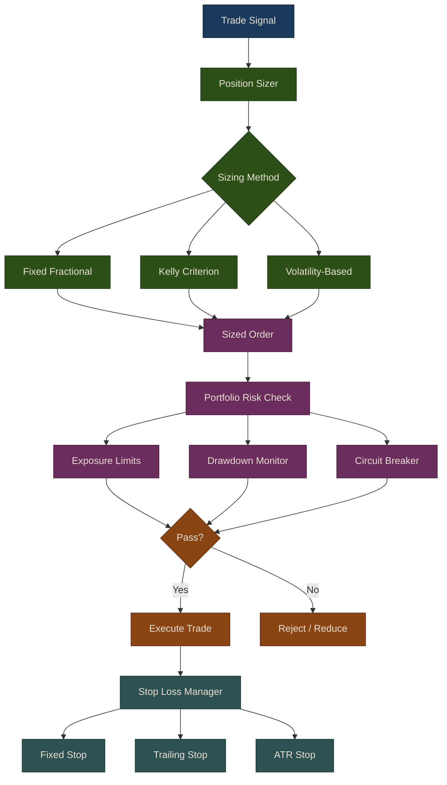

# Risk Management

Risk management is critical for long-term trading success. No matter how strong your alpha signal is, poor risk controls can destroy an account. The Puffin framework provides comprehensive tools for position sizing, stop loss management, and portfolio-level risk controls through the `puffin.risk` package.

## Risk Management Pipeline

This chapter is divided into three sections:

1. **[Position Sizing]({{ site.baseurl }}/24-risk-management/01-position-sizing)** -- Fixed fractional, Kelly criterion, and volatility-based methods for determining how much capital to allocate to each trade.
2. **[Stop Losses]({{ site.baseurl }}/24-risk-management/02-stop-losses)** -- Fixed, trailing, ATR, and time-based stops, plus a manager that combines multiple stop types per position.
3. **[Portfolio Risk Controls]({{ site.baseurl }}/24-risk-management/03-portfolio-risk-controls)** -- Drawdown monitoring, exposure limits, circuit breakers, Value at Risk, and concentration metrics.

---

## Best Practices

1. **Position Sizing**
   - Never risk more than 1-2% per trade
   - Use volatility-adjusted sizing
   - Scale position size with confidence

2. **Stop Losses**
   - Always use stops
   - Place stops beyond normal volatility
   - Consider using multiple stop types
   - Trail stops on profitable trades

3. **Portfolio Risk**
   - Monitor drawdown continuously
   - Limit total exposure
   - Implement circuit breakers
   - Track concentration metrics
   - Calculate VaR regularly

4. **Risk/Reward**
   - Target at least 2:1 reward/risk ratio
   - Use wider stops in volatile markets
   - Tighten stops in trending markets

## Related Chapters

- [Part 5: Portfolio Optimization]({{ site.baseurl }}/05-portfolio-optimization/) -- Mean-variance and risk-parity constraints that define the allocation boundaries risk controls enforce
- [Part 7: Backtesting]({{ site.baseurl }}/07-backtesting/) -- Walk-forward analysis reveals drawdown and risk profiles before going live
- [Part 23: Live Trading Execution]({{ site.baseurl }}/23-live-trading/) -- Position sizing and stop losses are applied in real time during order execution
- [Part 25: Monitoring & Analytics]({{ site.baseurl }}/25-monitoring-analytics/) -- Drawdown, VaR, and exposure metrics flow into dashboards for continuous risk monitoring

## Source Code

Browse the implementation: [`puffin/risk/`](https://github.com/MichaelTien8901/puffin/tree/main/puffin/risk)

## Next Steps

- See [Monitoring & Analytics]({{ site.baseurl }}/25-monitoring-analytics/) for performance tracking
- See [Live Trading]({{ site.baseurl }}/23-live-trading/01-live-trading) for integrating risk management
- Check `examples/` for complete implementations
