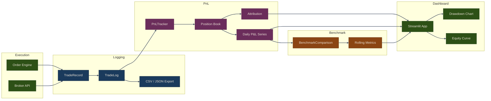

# Part 25: Monitoring & Analytics

Comprehensive monitoring and analytics are essential for understanding strategy performance and making informed trading decisions. The Puffin framework provides tools for trade logging, P&L tracking, benchmark comparison, system health monitoring, and real-time dashboards.

## Monitoring Pipeline



## Chapters

1. [Trade Logging & P&L](01-trade-logging-pnl) - Record every execution with `TradeLog` and `TradeRecord`, track realized and unrealized profit with `PnLTracker`, generate attribution reports by strategy and asset
2. [Benchmark Comparison](02-benchmark-comparison) - Compute alpha, beta, information ratio, and tracking error with `BenchmarkComparison`, visualize cumulative and rolling performance against SPY or custom benchmarks
3. [Streamlit Dashboard](03-streamlit-dashboard) - Build a real-time monitoring dashboard with portfolio overview, equity curve, drawdown analysis, position allocation, and filterable trade history

## Key Components

| Component | Module | Purpose |
|-----------|--------|---------|
| `TradeRecord` | `puffin.monitor.trade_log` | Immutable record of a single execution |
| `TradeLog` | `puffin.monitor.trade_log` | Collection of trades with filter, export, and summary |
| `PnLTracker` | `puffin.monitor.pnl` | Real-time P&L with position book and history |
| `Position` | `puffin.monitor.pnl` | Per-ticker position with market value and unrealized P&L |
| `BenchmarkComparison` | `puffin.monitor.benchmark` | Strategy-vs-benchmark analytics |
| `SystemHealth` | `puffin.monitor.health` | Data feed and broker health checks with alerting |
| `create_dashboard` | `puffin.monitor.dashboard` | Streamlit multi-page dashboard builder |

{: .note }
All monitoring components are designed to work independently or together. You can use `TradeLog` on its own for audit purposes, or wire everything into the Streamlit dashboard for a unified view.

## Quick Start

```python
from puffin.monitor.trade_log import TradeLog, TradeRecord
from puffin.monitor.pnl import PnLTracker
from puffin.monitor.benchmark import BenchmarkComparison
from puffin.monitor.health import SystemHealth

# Initialize the monitoring stack
log = TradeLog()
tracker = PnLTracker(initial_cash=100_000.0)
bc = BenchmarkComparison()
health = SystemHealth()
```

## Related Chapters

- [Part 24: Risk Management]({{ site.baseurl }}/24-risk-management/) -- Drawdown, VaR, and exposure metrics feed directly into monitoring dashboards
- [Part 23: Live Trading Execution]({{ site.baseurl }}/23-live-trading/) -- Live order fills and position updates generate the data that monitoring tracks
- [Part 7: Backtesting]({{ site.baseurl }}/07-backtesting/) -- Backtest results use the same analytics pipeline for equity curves and benchmark comparison
- [Part 22: AI-Assisted Trading]({{ site.baseurl }}/22-ai-assisted-trading/) -- AI-generated market reports and sentiment summaries surface in monitoring views

## Next Steps

- See [Risk Management]({{ site.baseurl }}/24-risk-management/) for risk controls that feed into monitoring
- See [Live Trading]({{ site.baseurl }}/23-live-trading/01-live-trading) for production deployment patterns
