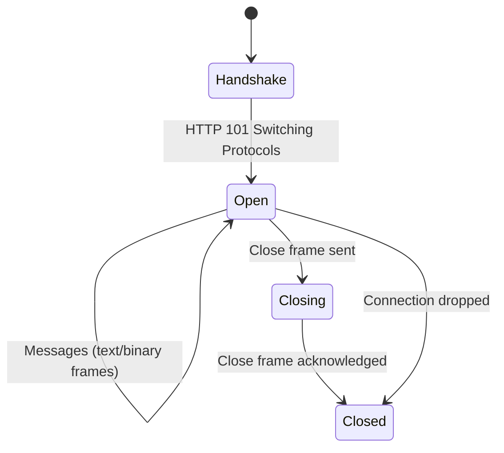

# WebSocket Fundamentals

Before streaming live market data, you need to understand the protocol that makes it possible. WebSockets provide full-duplex communication over a single TCP connection — the backbone of real-time market data feeds.

## Why WebSockets for Market Data?

REST APIs use a request-response model: you ask, the server answers. For market data, this means polling — repeatedly asking "what's the price now?" This wastes bandwidth and introduces latency.

WebSockets flip this model. After an initial HTTP handshake, the connection stays open. The server **pushes** updates the moment they happen:

```
REST Polling (bad for real-time):
  Client → Server: GET /price/AAPL     (every 100ms)
  Server → Client: {"price": 150.00}
  Client → Server: GET /price/AAPL     (100ms later)
  Server → Client: {"price": 150.01}
  ...

WebSocket (designed for real-time):
  Client → Server: Upgrade to WebSocket (once)
  Server → Client: {"price": 150.00}   (instant push)
  Server → Client: {"price": 150.01}   (20ms later)
  Server → Client: {"price": 150.02}   (5ms later)
  ...
```

## Connection Lifecycle

A WebSocket connection follows four phases:



### 1. Handshake

The client sends a regular HTTP request with an `Upgrade: websocket` header. The server responds with `101 Switching Protocols`, and the TCP connection is "upgraded" to WebSocket.

### 2. Open (Message Exchange)

Once open, either side can send **frames** at any time:

| Frame Type | Use |
|-----------|-----|
| **Text** | JSON messages (most market data APIs) |
| **Binary** | Compressed or binary-encoded data (FIX, ITCH) |
| **Ping** | Heartbeat — "are you still there?" |
| **Pong** | Reply to ping — "yes, I'm here" |

### 3. Closing

Either side sends a close frame. The other side acknowledges, and the connection terminates gracefully.

### 4. Dropped Connection

Network issues can kill the connection without a close frame. Your client must detect this (via missed heartbeats or socket errors) and reconnect.

## Heartbeats

Market data WebSockets use heartbeats to detect dead connections. There are two patterns:

**Server-initiated ping**: The server sends periodic pings. If the client doesn't respond with a pong within a timeout, the server drops the connection.

**Application-level heartbeat**: The server sends a heartbeat message (e.g., `{"type": "heartbeat"}`) at a fixed interval. If the client stops receiving heartbeats, it knows the connection is dead.

```python
# Detecting a dead connection via heartbeat timeout
import time

last_heartbeat = time.time()
HEARTBEAT_TIMEOUT = 30  # seconds

def on_message(msg):
    global last_heartbeat
    if msg.get("type") == "heartbeat":
        last_heartbeat = time.time()
        return
    # Process market data...

def check_health():
    if time.time() - last_heartbeat > HEARTBEAT_TIMEOUT:
        raise ConnectionError("Heartbeat timeout — reconnecting")
```

## Market Data Message Types

Market data feeds typically provide three categories of streaming data:

### Trades

Individual transactions — a buyer and seller matched at a price:

```json
{
  "type": "trade",
  "symbol": "AAPL",
  "price": 150.25,
  "size": 100,
  "timestamp": "2024-01-15T14:30:00.123Z",
  "conditions": ["@", "F"]
}
```

### Quotes (Level 1)

The current best bid and ask — what you'd pay to buy or sell right now:

```json
{
  "type": "quote",
  "symbol": "AAPL",
  "bid": 150.20,
  "ask": 150.25,
  "bid_size": 300,
  "ask_size": 200,
  "timestamp": "2024-01-15T14:30:00.125Z"
}
```

### Order Book Depth (Level 2)

Multiple price levels of resting orders — the full supply/demand picture:

```json
{
  "type": "l2_update",
  "symbol": "AAPL",
  "bids": [
    [150.20, 300],
    [150.15, 500],
    [150.10, 1200]
  ],
  "asks": [
    [150.25, 200],
    [150.30, 400],
    [150.35, 800]
  ]
}
```

## Provider Comparison

Each market data provider has a different WebSocket implementation:

| Feature | Alpaca | Interactive Brokers | Polygon.io |
|---------|--------|-------------------|------------|
| **Protocol** | WebSocket (wss://) | TCP socket (TWS API) | WebSocket (wss://) |
| **Auth** | API key in first message | Client ID on connect | API key in first message |
| **Message format** | JSON | Binary (custom protocol) | JSON |
| **Trades** | Yes | Yes (5-sec bars) | Yes |
| **Quotes (L1)** | Yes | Yes | Yes |
| **Order book (L2)** | No | Yes (market depth) | No (paid tier) |
| **Heartbeat** | Application-level | TCP keepalive | Application-level |
| **Reconnect support** | Client-side | Client-side | Client-side |
| **Free tier** | Yes (15-min delay on free) | No (requires account) | Yes (limited) |

{: .note }
Interactive Brokers doesn't use WebSockets — it uses a proprietary TCP socket protocol via TWS or IB Gateway. The `ib_async` library abstracts this, so from your code's perspective, it behaves similarly to a WebSocket stream.

## Common Pitfalls

1. **Not handling backpressure**: If your callback is slower than the message rate, messages queue up and memory grows. Use a bounded queue or drop stale messages.

2. **Reconnecting without resubscribing**: After reconnecting, you must re-send your subscription messages. The server doesn't remember your previous session.

3. **Assuming message order**: Network conditions can reorder messages. Use sequence numbers or timestamps to detect gaps.

4. **Ignoring market hours**: Streams may behave differently outside regular trading hours (wider spreads, lower volume, different message types).

## Exercises

1. **Explore a WebSocket connection**: Use Python's `websockets` library to connect to a public WebSocket echo server (`wss://echo.websockets.org`). Send a message and observe the response. Then implement a heartbeat that sends a ping every 10 seconds.

2. **Examine Alpaca's message format**: If you have an Alpaca API key, connect to their WebSocket endpoint and subscribe to trade updates for a symbol. Print each raw message to understand the schema before parsing it.

3. **Design a message schema**: Sketch out a normalized message format that could represent trades, quotes, and order book updates from any provider. Compare your design with Puffin's `Trade`, `Quote`, and `OrderBookUpdate` dataclasses.

## Next Steps

Now that you understand the protocol, let's build a real-time streaming engine that handles all of this for you — in [Real-Time Engine](02-realtime-engine).
