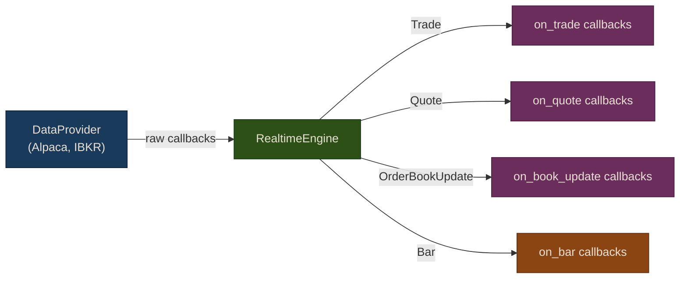
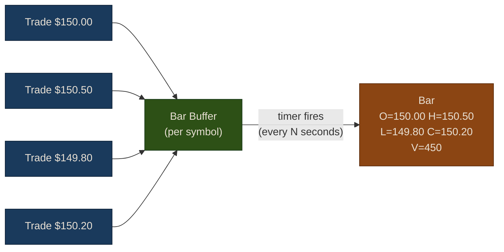

# Chapter 2: Real-Time Engine

The `RealtimeEngine` provides a unified streaming interface on top of any `DataProvider`. It handles callback dispatch, tick-to-bar aggregation, and auto-reconnection so you can focus on processing data.

## Quick Start

```python
from puffin.data.alpaca_provider import AlpacaProvider
from puffin.data.realtime import RealtimeEngine

provider = AlpacaProvider()
engine = RealtimeEngine(provider)

# Register callbacks
engine.on_trade(lambda t: print(f"Trade: {t.symbol} ${t.price:.2f} x{t.volume}"))
engine.on_quote(lambda q: print(f"Quote: {q.symbol} {q.bid}/{q.ask}"))

# Start streaming
engine.start(["AAPL", "MSFT"])

# ... later
engine.stop()
```

## Architecture

The engine sits between your data provider and your strategy code:



The engine wraps the provider's streaming methods and dispatches typed messages (`Trade`, `Quote`, `OrderBookUpdate`) to your registered callbacks. If the provider only supports the legacy `stream_realtime()`, the engine falls back to that automatically.

## Typed Messages

All streaming data arrives as typed dataclasses:

```python
from puffin.data.realtime import Trade, Quote, OrderBookUpdate, Bar

# Each has symbol and timestamp, plus type-specific fields:
# Trade:           price, volume
# Quote:           bid, ask, bid_size, ask_size
# OrderBookUpdate: side ("bid"/"ask"), price, size (0 = remove)
# Bar:             open, high, low, close, volume, interval
```

## Registering Callbacks

Register as many callbacks as you need per stream type:

```python
# Log all trades
engine.on_trade(lambda t: logger.info("Trade: %s $%.2f", t.symbol, t.price))

# Feed trades to your strategy
engine.on_trade(strategy.on_new_trade)

# Monitor quotes
engine.on_quote(lambda q: print(f"Spread: {q.ask - q.bid:.4f}"))

# Lifecycle events
engine.on_reconnect(lambda: print("Reconnected!"))
engine.on_error(lambda msg: print(f"Error: {msg}"))
```

All callbacks for the same type are invoked in registration order.

## Tick-to-Bar Aggregation

Raw trade ticks arrive hundreds of times per second for active symbols. Often you want aggregated OHLCV bars instead:

```python
engine.set_bar_interval(60)  # 1-minute bars

def on_bar(bar):
    print(f"{bar.symbol} {bar.interval}s bar: "
          f"O={bar.open:.2f} H={bar.high:.2f} L={bar.low:.2f} C={bar.close:.2f} "
          f"V={bar.volume}")

engine.on_bar(on_bar)
engine.start(["AAPL", "MSFT"])
```

How it works:



The engine maintains a separate buffer per symbol. When the timer fires, it emits a `Bar` for each symbol that received trades and resets the buffer. Symbols with no trades in the interval produce no bar.

Supported intervals: any integer seconds (common values: 1, 5, 10, 30, 60, 300).

## Auto-Reconnection

Network interruptions are inevitable. The engine automatically reconnects using exponential backoff:

| Attempt | Delay |
|---------|-------|
| 1 | 1s |
| 2 | 2s |
| 3 | 4s |
| 4 | 8s |
| 5 | 16s |
| 6 | 32s |
| 7+ | 60s (max) |

After 10 consecutive failures, the engine gives up and fires `on_error`. On successful reconnection, it resubscribes to all symbols and fires `on_reconnect`.

```python
engine.on_reconnect(lambda: print("Stream recovered"))
engine.on_error(lambda msg: alert_ops_team(msg))
```

{: .warning }
Order book state is cleared on reconnection. See [Chapter 3](03-orderbook-streaming) for details on rebuilding from a fresh snapshot.

## Multi-Provider Usage

Create separate engines for different providers:

```python
from puffin.data.alpaca_provider import AlpacaProvider
from puffin.data.ibkr_provider import IBKRDataProvider

# Alpaca for equities
alpaca_engine = RealtimeEngine(AlpacaProvider())
alpaca_engine.on_trade(handle_equity_trade)
alpaca_engine.start(["AAPL", "MSFT"])

# IBKR for futures
ibkr_engine = RealtimeEngine(IBKRDataProvider())
ibkr_engine.on_trade(handle_futures_trade)
ibkr_engine.start(["ES", "NQ"])
```

## Stream-to-Cache Pipeline

A common pattern is persisting streaming data to your local cache for later analysis:

```python
from puffin.data.cache import DataCache
from puffin.data.realtime import RealtimeEngine, Trade
import pandas as pd

cache = DataCache()
trade_buffer = []

def buffer_trade(trade: Trade):
    trade_buffer.append({
        "symbol": trade.symbol,
        "price": trade.price,
        "volume": trade.volume,
        "timestamp": trade.timestamp,
    })
    # Flush every 100 trades
    if len(trade_buffer) >= 100:
        flush_buffer()

def flush_buffer():
    if not trade_buffer:
        return
    df = pd.DataFrame(trade_buffer)
    for symbol, group in df.groupby("symbol"):
        cache.put(symbol, group.set_index("timestamp"))
    trade_buffer.clear()

engine.on_trade(buffer_trade)
engine.start(["AAPL"])
```

{: .tip }
Buffering before writing avoids hammering the database with individual inserts. Tune the buffer size based on your message rate and latency requirements.

## Exercises

1. **Stream-to-cache pipeline**: Using the pattern above, build a pipeline that streams 5 minutes of trade data for 3 symbols and writes it to SQLite. Query the cache afterward to verify the data.

2. **Tick anomaly detection**: Register a trade callback that flags anomalous ticks — trades where the price jumps more than 1% from the previous trade for the same symbol. Track the last price per symbol in a dictionary.

3. **Multi-interval bars**: Set up two engines on the same provider — one with 5-second bars and one with 1-minute bars. Compare how the different intervals smooth out price noise.

## Next Steps

For order book streaming and depth analysis, continue to [Chapter 3: Order Book Streaming](03-orderbook-streaming).
