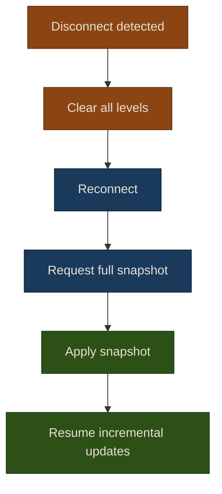

# Chapter 3: Order Book Streaming

The order book is the most granular view of supply and demand for a security. Streaming order book data lets you see not just the best bid/ask, but the full depth of resting orders at every price level.

## Level 1 vs Level 2

Market data comes in two levels of detail:

| | Level 1 (Quotes) | Level 2 (Depth) |
|---|---|---|
| **What** | Best bid and best ask | Multiple price levels on each side |
| **Depth** | Top of book only | 5-50 levels typically |
| **Update rate** | Every quote change | Every level change |
| **Use case** | Spread monitoring, simple strategies | Market microstructure, liquidity analysis |
| **Availability** | All providers | IBKR, some paid tiers |

```
Level 1 (you see):          Level 2 (you see):
  Bid: $150.20 x 300          Bids:              Asks:
  Ask: $150.25 x 200          $150.20 x 300      $150.25 x 200
                               $150.15 x 500      $150.30 x 400
                               $150.10 x 1200     $150.35 x 800
                               $150.05 x 2000     $150.40 x 150
```

## The OrderBook Class

Puffin maintains a local `OrderBook` per symbol, updated incrementally from L2 stream messages:

```python
from puffin.data.realtime import RealtimeEngine, OrderBook

engine = RealtimeEngine(provider)
engine.start(["AAPL"])

# Access the live order book
book = engine.get_order_book("AAPL")

# Top-of-book
print(f"Best bid: ${book.best_bid:.2f}")
print(f"Best ask: ${book.best_ask:.2f}")
print(f"Spread:   ${book.spread:.4f}")

# Full depth
for price, size in book.bids[:5]:  # top 5 bid levels
    print(f"  Bid: ${price:.2f} x {size}")
for price, size in book.asks[:5]:  # top 5 ask levels
    print(f"  Ask: ${price:.2f} x {size}")
```

### How Updates Work

Providers send incremental updates, not full snapshots. Each update says "at this price level, the size is now X":

```python
from puffin.data.realtime import OrderBookUpdate
from datetime import datetime

# New bid level appears
update = OrderBookUpdate("AAPL", "bid", 150.20, 300, datetime.now())
book.update(update)  # Adds or updates the level

# Level gets removed (size = 0)
update = OrderBookUpdate("AAPL", "bid", 150.20, 0, datetime.now())
book.update(update)  # Removes the level
```

### Snapshot Reset on Reconnection

If the stream disconnects, you may miss updates. Applying incremental updates to a stale book produces incorrect state. The engine handles this automatically:



{: .warning }
During the brief window between disconnect and snapshot rebuild, the order book is empty. Your strategy code should handle `None` returns from `best_bid`/`best_ask` gracefully.

## Spread Analysis

The bid-ask spread is a key measure of liquidity and trading cost:

```python
def monitor_spread(engine, symbol):
    """Track spread over time for analysis."""
    spreads = []

    def on_book_change(update):
        if update.symbol != symbol:
            return
        book = engine.get_order_book(symbol)
        if book.spread is not None:
            spreads.append({
                "timestamp": update.timestamp,
                "spread": book.spread,
                "best_bid": book.best_bid,
                "best_ask": book.best_ask,
            })

    engine.on_book_update(on_book_change)
    return spreads
```

Common spread metrics:

| Metric | Formula | What It Tells You |
|--------|---------|-------------------|
| **Absolute spread** | ask - bid | Raw trading cost in dollars |
| **Relative spread** | (ask - bid) / midpoint | Cost as a percentage |
| **Midpoint** | (bid + ask) / 2 | Fair value estimate |
| **Depth at touch** | bid_size + ask_size at best levels | Immediate liquidity available |

## Depth Imbalance

The ratio of bid to ask volume near the top of book can signal short-term price direction:

```python
def calculate_imbalance(book: OrderBook, levels: int = 5) -> float:
    """Calculate order book imbalance.

    Returns value between -1 (all asks) and +1 (all bids).
    Positive values suggest buying pressure.
    """
    bid_vol = sum(size for _, size in book.bids[:levels])
    ask_vol = sum(size for _, size in book.asks[:levels])
    total = bid_vol + ask_vol
    if total == 0:
        return 0.0
    return (bid_vol - ask_vol) / total
```

{: .note }
Order book imbalance is a well-studied signal in market microstructure research. However, displayed liquidity is only part of the story — hidden orders, icebergs, and spoofing can all distort the visible book. Use imbalance as one input among many, not a standalone signal.

## Visualizing the Order Book

A depth chart shows cumulative volume at each price level:

```python
import matplotlib.pyplot as plt

def plot_depth(book: OrderBook, title: str = "Order Book Depth"):
    """Plot cumulative bid/ask depth."""
    # Cumulative bid volume (right to left)
    bid_prices = [p for p, _ in book.bids]
    bid_cum = []
    total = 0
    for _, size in book.bids:
        total += size
        bid_cum.append(total)

    # Cumulative ask volume (left to right)
    ask_prices = [p for p, _ in book.asks]
    ask_cum = []
    total = 0
    for _, size in book.asks:
        total += size
        ask_cum.append(total)

    fig, ax = plt.subplots(figsize=(10, 5))
    ax.fill_between(bid_prices, bid_cum, alpha=0.4, color="green", label="Bids")
    ax.fill_between(ask_prices, ask_cum, alpha=0.4, color="red", label="Asks")
    ax.set_xlabel("Price")
    ax.set_ylabel("Cumulative Volume")
    ax.set_title(title)
    ax.legend()
    plt.tight_layout()
    return fig
```

## Exercises

1. **Spread tracker**: Build a callback that tracks the spread for a symbol over time and computes the average, min, and max spread over a 5-minute window. Print a summary when the window closes.

2. **Depth imbalance monitor**: Implement the `calculate_imbalance` function above and register it as a book update callback. Print warnings when the imbalance exceeds +0.7 or -0.7 (strong directional pressure).

3. **Order book visualization**: Using the `plot_depth` function, capture a snapshot of the order book at 10-second intervals for 2 minutes. Create an animation or grid of plots showing how the depth profile evolves over time.

## Further Reading

- The [Data Pipeline]({{ site.baseurl }}/02-data-pipeline/) chapter covers the `DataProvider` interface and historical data fetching.
- The [Live Trading]({{ site.baseurl }}/23-live-trading/01-live-trading) chapter covers using real-time data to execute trades with Alpaca and IBKR.
