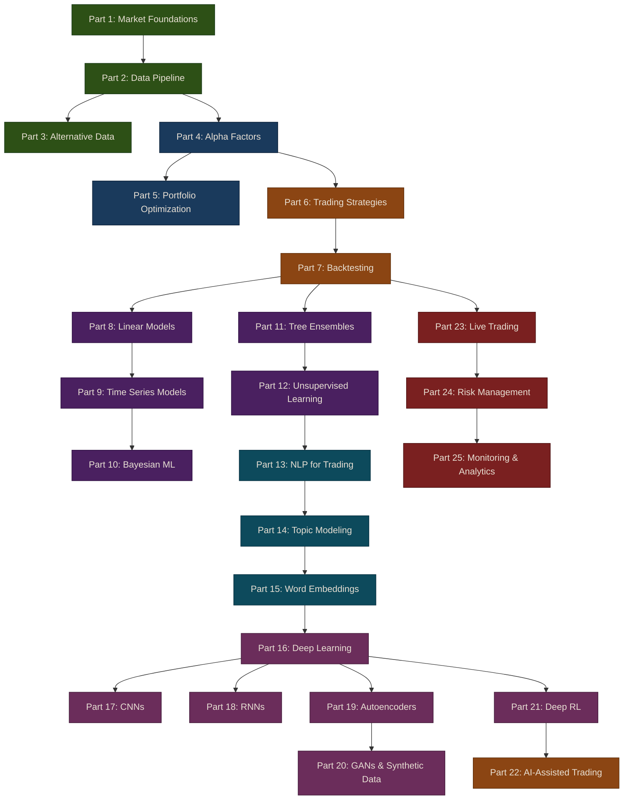

# Puffin: Algorithmic Trading Guide

A comprehensive, hands-on guide to building algorithmic trading systems — from market fundamentals through machine learning, deep learning, and AI-assisted trading. Based on Stefan Jansen's *Machine Learning for Algorithmic Trading* (2nd Edition) and extended with modern LLM-powered trading.

{: .note }
This guide is designed to be followed sequentially. Each part builds on concepts and code from previous parts.

[Start Learning — Part 1: Market Foundations](01-market-foundations/){: .btn .btn-green .fs-5 .mb-4 .mb-md-0 .mr-2 }

## Learning Path



## Parts

| Part | Topic | What You'll Learn |
|------|-------|-------------------|
| [1. Market Foundations](01-market-foundations/) | How markets work | Exchanges, order books, asset classes, market microstructure |
| [2. Data Pipeline](02-data-pipeline/) | Getting market data | Data providers, caching, preprocessing, HDF5/Parquet storage |
| [3. Alternative Data](03-alternative-data/) | Non-traditional data | Web scraping, earnings calls, alternative data evaluation |
| [4. Alpha Factors](04-alpha-factors/) | Predictive signals | TA-Lib, Kalman filter, wavelets, Alphalens, WorldQuant alphas |
| [5. Portfolio Optimization](05-portfolio-optimization/) | Building portfolios | Mean-variance, risk parity, HRP, pyfolio tearsheets |
| [6. Trading Strategies](06-trading-strategies/) | Classical strategies | Momentum, mean reversion, stat arb, market making |
| [7. Backtesting](07-backtesting/) | Testing strategies | Event-driven backtester, walk-forward analysis |
| [8. Linear Models](08-linear-models/) | Linear ML | OLS, ridge, lasso, Fama-French factor models |
| [9. Time Series Models](09-time-series-models/) | Time series | ARIMA, VAR, GARCH, cointegration, pairs trading |
| [10. Bayesian ML](10-bayesian-ml/) | Bayesian methods | PyMC, Bayesian Sharpe, stochastic volatility |
| [11. Tree Ensembles](11-tree-ensembles/) | Gradient boosting | Random forests, XGBoost, LightGBM, CatBoost, SHAP |
| [12. Unsupervised Learning](12-unsupervised-learning/) | Clustering & PCA | Eigenportfolios, k-means, hierarchical clustering |
| [13. NLP for Trading](13-nlp-trading/) | Text analysis | spaCy, TF-IDF, naive Bayes, sentiment analysis |
| [14. Topic Modeling](14-topic-modeling/) | Document topics | LSI, LDA, pyLDAvis, earnings call analysis |
| [15. Word Embeddings](15-word-embeddings/) | Semantic analysis | word2vec, GloVe, doc2vec, BERT, SEC filings |
| [16. Deep Learning](16-deep-learning/) | Neural networks | Feedforward NNs, PyTorch, TensorFlow, TensorBoard |
| [17. CNNs for Trading](17-cnns-for-trading/) | Convolutions | 1D CNN, CNN-TA image approach, transfer learning |
| [18. RNNs for Trading](18-rnns-for-trading/) | Sequence models | LSTM, GRU, stacked RNNs, sentiment classification |
| [19. Autoencoders](19-autoencoders/) | Feature extraction | Denoising AE, VAE, conditional AE for pricing |
| [20. GANs & Synthetic Data](20-synthetic-data-gans/) | Data generation | TimeGAN, synthetic financial time series |
| [21. Deep RL](21-deep-rl/) | RL agents | Q-learning, DQN, DDQN, PPO, trading agents |
| [22. AI-Assisted Trading](22-ai-assisted-trading/) | LLM-powered trading | Sentiment, news signals, AI agent portfolio mgmt |
| [23. Live Trading](23-live-trading/) | Going live | Paper trading, broker integration, order management |
| [24. Risk Management](24-risk-management/) | Managing risk | Position sizing, stop losses, VaR, portfolio controls |
| [25. Monitoring & Analytics](25-monitoring-analytics/) | Tracking performance | Dashboards, trade logs, P&L attribution |

## Prerequisites

- Python 3.11+
- Basic Python programming knowledge
- Basic understanding of financial markets (helpful but not required)

## Quick Start

```bash
# Clone the repository
git clone https://github.com/MichaelTien8901/puffin.git
cd puffin

# Install core dependencies
pip install -e .

# Install all optional dependencies (ML, NLP, AI, dashboard, dev tools)
pip install -e ".[all]"

# Copy environment template and add your API keys
cp .env.example .env
```

## Project Structure

```
puffin/
├── docs/            # This tutorial site (Jekyll + Just the Docs)
├── puffin/          # Python package
│   ├── data/        # Data pipeline
│   ├── factors/     # Alpha factor research
│   ├── portfolio/   # Portfolio optimization
│   ├── strategies/  # Trading strategies
│   ├── backtest/    # Backtesting engine
│   ├── models/      # Linear & time series models
│   ├── ensembles/   # Tree ensemble models
│   ├── unsupervised/# PCA, clustering
│   ├── nlp/         # NLP for trading
│   ├── deep/        # Deep learning (CNN, RNN, AE, GAN)
│   ├── rl/          # Deep reinforcement learning
│   ├── ml/          # ML utilities
│   ├── ai/          # AI-assisted trading (LLMs)
│   ├── broker/      # Live trading
│   ├── risk/        # Risk management
│   └── monitor/     # Monitoring & analytics
├── tests/           # Test suite
└── notebooks/       # Interactive Jupyter notebooks
```
